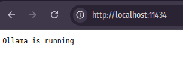
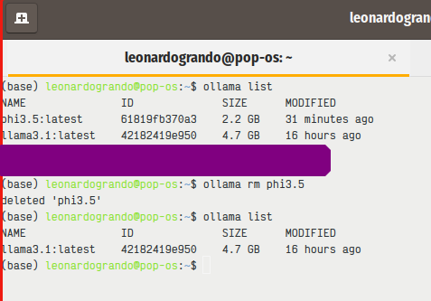

Outros posts sobre o tema em:

[Como Criar um Pipeline em Python para Testar Modelos no Hugging Face](https://lgrando1.github.io/post/hface/)

[Dicas de Engenharia de Prompt](https://lgrando1.github.io/post/prompt1/)

[Parte 2 - Instalando o Ollama no Windows](https://lgrando1.github.io/post/ollamawin/)

[Parte 3 - Instalando LLMs Off-line no Android- pt.1](https://lgrando1.github.io/post/llmandroid/)

[Parte 4 - Instalando LLMs Off-line no Android - pt.2](https://lgrando1.github.io/post/llmtermux/)

[Parte 5 - Quatro Maneiras de Usar LLMs Offline no Seu Computador](https://lgrando1.github.io/post/waysllms)

[Parte 6 - RAG Offline: Usando LM Studio e Ollama para Processar Documentos](https://lgrando1.github.io/post/rag/)

O recém [**artigo da Nature**](https://www.nature.com/articles/d41586-024-02998-y) trouxe uma discussão sobre o uso de LLMs locais em vez daquelas que utilizamos de forma online como, por exemplo, o Chat-GPT, Gemini e o CoPilot. A preocupação com aspectos como privacidade e o uso de nossos dados quando utilizando os LLMs de terceiros, sem contar que estas ferramentas necessitam de acesso à internet. 
Sites como o [Hugging Face](https://huggingface.co/) permitem testar alguns usos destas ferramentas utilizando uma biblioteca com a linguagem Python, como eu já descrevi em [uma postagem anterior.](https://lgrando1.github.io/post/hface/) 

Eu queria algo mais completo como um assistente virtual local e como sou usuário Linux (uso o Pop!_OS 20.04), encontrei este [post muito bem explicado](https://itsfoss.com/ollama-setup-linux/) de como rodar uma LLM de maneira off-line no Linux e então resolvi replicar, e conto esta experiência abaixo.

O [Ollama](https://ollama.com/) é uma ferramenta que facilita o processo de baixar e rodar os modelos LLMs de código aberto. Ele pode ser instalado no Windows, MacOS e o Linux. Apenas seguir o [procedimento de instalação presente no site deles](https://ollama.com/download). 

O vídeo abaixo mostra o desempenho destes modelos em meu computador para duas tarefas de geração de códigos em duas linguagens de programação.



No meu caso utilizei o comando abaixo, mas recomendo que você siga o procedimento descrito pelo site pois o mesmo pode alterar conforme novas atualizações. 

**Repetindo: siga o procedimento de instalação conforme descrito no site deles, não este daqui**.

~~~bash
curl -fsSL https://ollama.com/install.sh | sh 
~~~
  
O código acima irá baixar o Ollama em sua máquina e rodar o script de instalação. Você pode auditar o script de [instalação aqui](https://github.com/ollama/ollama/blob/main/scripts/install.sh)

A minha máquina é um notebook Acer Nitro que adquiri no final de 2020. Ele possui um Core i5 9300H, 16 GB de RAM e uma GPU Nvidia GeForce GTX 1650. O que fica interessante, pois o Ollama reconheceu a GPU. 

Na [postagem que usei como referência](https://itsfoss.com/ollama-setup-linux/) para instalar, o autor descreve que o Notebook dele não possui uma GPU discreta, o que influenciou no desempenho. E o modelo escolhido vai também influenciar. 

Hora de testar se o Ollama está rodando, num browser digite:

Aqui mostrou que está funcionando. 

Agora é hora de baixar o modelo LLM. No [site](https://ollama.com/library) existe vários modelos. Já testei o llama3.1. Este [modelo desenvolvido pela Meta](https://ollama.com/library/llama3.1) e que possui três níveis de parâmetros 8, 70 e 405 bilhões de parâmetros. Acabei escolhendo o modelo de 8B. São aproximadamente 4.7 GB utilizado de armazenamento. Mas ai fica o critério de cada um. Para este post vou apresentar o processo de instalação do modelo [phi3.5 da Microsoft](https://ollama.com/library/phi3.5).
 

Para dar um "pull" em um modelo LLM desejado, utiliza-se o comando:

~~~bash
ollama pull <Nome_da_LLM>
~~~

Então para baixar e instalar o modelo [Phi3.5 da Microsoft](https://ollama.com/library/phi3.5).

~~~bash
ollama pull phi3.5
~~~

Agora vamos **listar** as imagens que estão presentes no seu computador.

~~~bash
ollama list
~~~

Para **rodar** uma das LLMs com o código:

~~~bash
ollama run <Nome_da_LLM>
~~~

No caso da Phi3

~~~bash
ollama run phi3.5
~~~

Mas antes de tudo, para fins de demostração, garantirei que não está ocorrendo comunicação com a internet:

Aqui vou pedir para que ele me gere um código Python para conectar a uma base do MySQL:

Não vou me estender na utilização dele ou de outro modelo, mas é possível utilizar o próprio terminal para conversar com a LLM, e existem formas de conversar via interface gráfica, o que fica para um próximo post.

Agora para avaliar o uso computacional da minha máquina, vou utilizando o utilitário Nvidia-smi em que é possível ver o quanto ele está utilizando os recursos da GPU

E em relação ao uso computacional da CPU e do consumo de memória RAM ele não ficou utilizavel, lembrando que o Phi3.5 é um modelo particularmente pequeno. O print abaixo apresenta o consumo computacional durante uma inferência:

Agora para *sair* do Ollama, basta digitar no prompt: 

~~~bash
/bye
~~~

E para gerenciar e *deletar os modelos LLMs*, é possível listar e solicitar a remoção da imagem. 
PS: peço desculpas na imagem abaixo por que digitei um comando errado, por isto ocultei o mesmo, para evitar confusão.

~~~bash
ollama rm <nome_da_LLM>
~~~

Este tutorial aborda apenas alguns aspectos do uso do Ollama, o [tutorial que serviu como base](https://itsfoss.com/ollama-setup-linux/) para este experimento possui mais informações, como utilizar a interface gráfica com Docker e também como desinstalar o Ollama. Assim você tem um assistente local para lhe ajudar em tarefas simples. Ontem testei o uso do Llamma 3.1 para criar um banco de dados no MySQL e para implementar um código Python para interagir com este banco de dados e o código proposto funcionou. Mas é preciso testar mais. 

Sucesso a todos! 

