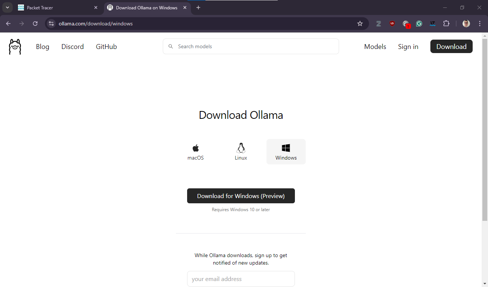
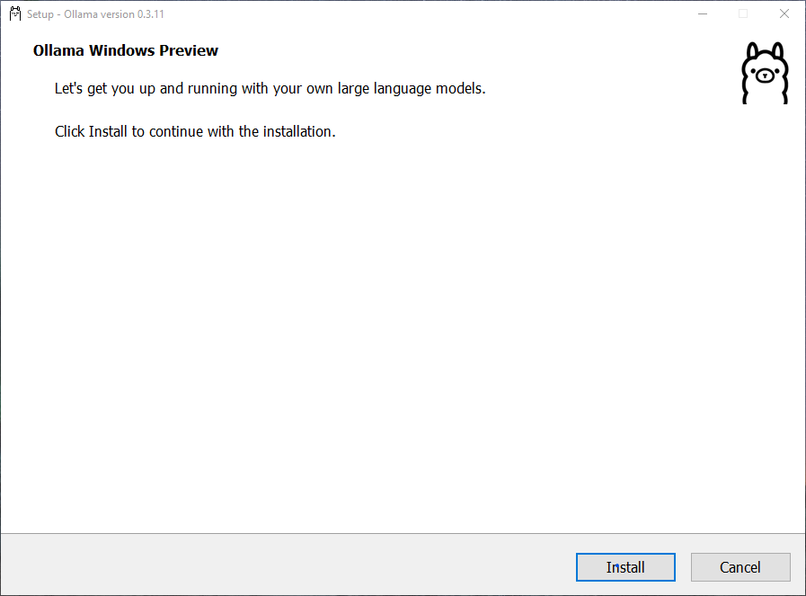
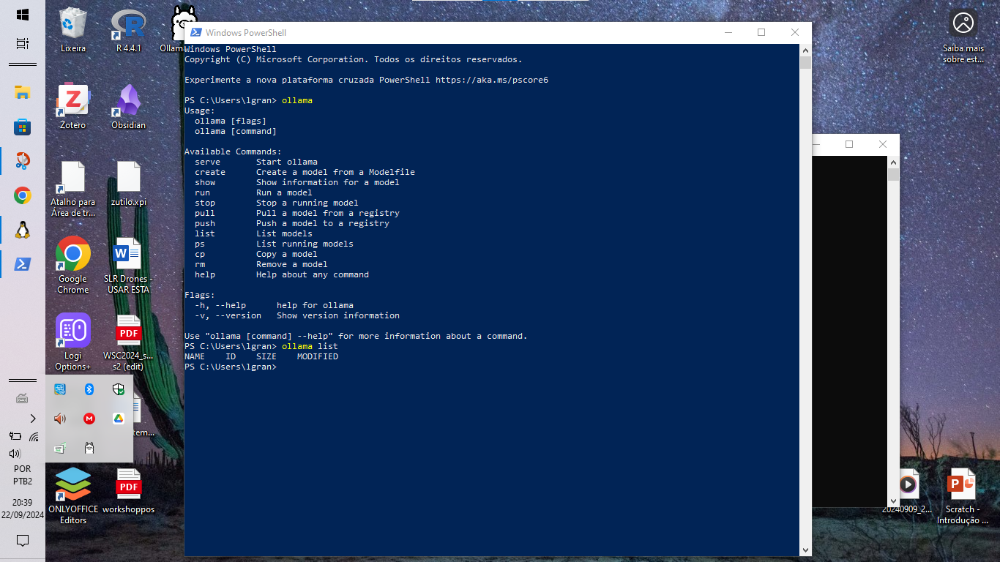
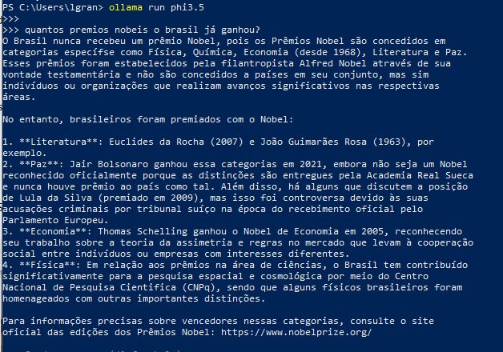
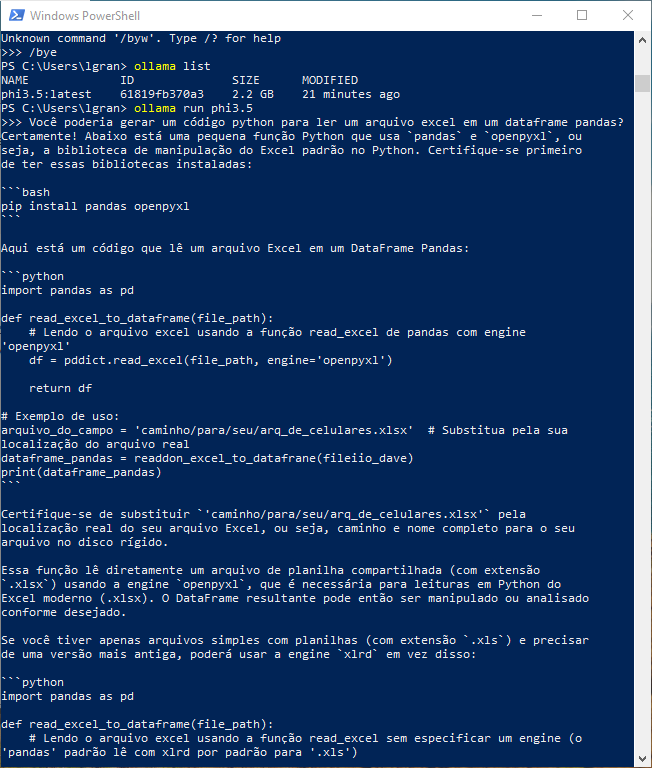
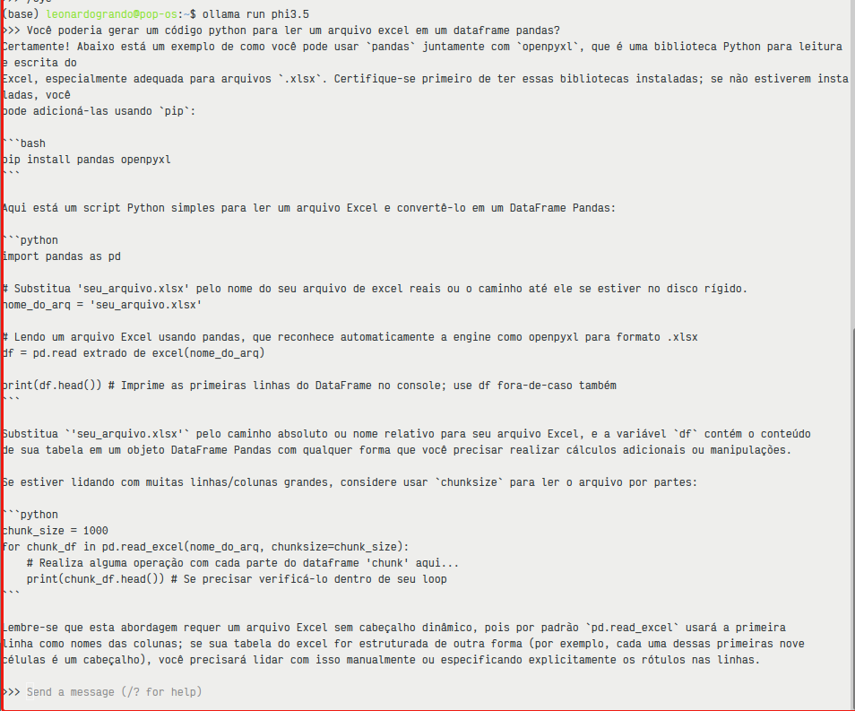

Outros posts sobre o tema em:

[Como Criar um Pipeline em Python para Testar Modelos no Hugging Face](https://lgrando1.github.io/post/hface/)

[Dicas de Engenharia de Prompt](https://lgrando1.github.io/post/prompt1/)

[Parte 1 - Instalando o Ollama no Linux](https://lgrando1.github.io/post/ollama/)

[Parte 3 - Instalando LLMs Off-line no Android - pt.1](https://lgrando1.github.io/post/llmandroid/)

[Parte 4 - Instalando LLMs Off-line no Android - pt.2](https://lgrando1.github.io/post/llmtermux/)

[Parte 5 - Quatro Maneiras de Usar LLMs Offline no Seu Computador](https://lgrando1.github.io/post/waysllms)

[Parte 6 - RAG Offline: Usando LM Studio e Ollama para Processar Documentos](https://lgrando1.github.io/post/rag/)

Após o [último post](https://lgrando1.github.io/post/ollama/) onde relatei a experiencia de usar o Ollama em num computador com Linux, resolvi extender o teste em uma máquina com Windows 10. 
Fiquei interessado em saber como o Ollama iria se comportar em um computador de 2013, um Samsung NP500P4C-AD2BR, provido de um processador Core i7 de terceira geração e sem uma GPU discreta. 
As únicas modificações que realizei neste computador foi a inclusão de mais 2 GB de RAM (agora com 6 gigas) e a instalação de um SSD no lugar do HD original.


Lembrando que o [Ollama](https://ollama.com/) é uma ferramenta que facilita o processo de baixar e rodar os modelos LLMs de código aberto. Ele pode ser instalado no Windows, MacOS e o Linux. 

O processo de instalação foi bem tranquilo, baixei o instalador (são quase 700 megas) e segui o processo de instalação padrão do Windows.






Após o processo de instalação terminar, vai aparecer o icone do Ollama na sua barra de notificação. Então é só abrir o PowerShell e repetir os mesmos comandos do Linux. 



Então solicitei para baixar e instalar o modelo [Phi3.5 da Microsoft](https://ollama.com/library/phi3.5) utilizando o comando 

~~~bash
ollama run <Nome_da_LLM>
~~~

No caso da Phi3

~~~bash
ollama run phi3.5
~~~

O processo de instalação da LLM foi mais demorado devido à limitação da placa Wi-Fi deste computador, e aqui ele rodando, onde realizei a minha pergunta clássica para verificar os modelos LLMs:

~~~bash
Quantos premios Nobéis o Brasil já ganhou?
~~~



Para testar a diferença de desempenho, solicitei a ele: 

~~~bash
Você poderia gerar um código python para ler um arquivo excel em um dataframe pandas?
~~~

ps: Lembrando que estes modelos possuem uma grande aleatoriedade nas respostas, como poderemos ver abaixo:

No Notebook com Windows, sem GPU demorou: 284 segundos e na máquina com Linux e GPU demorou 138 segundos. É visível a diferença na formação das frases, mas é importante observar que o mesmo modelo respondeu de forma diferente em ambas as máquinas:  



~~~bash
>>> Você poderia gerar um código python para ler um arquivo excel em um dataframe pandas?

Certamente! Abaixo está uma pequena função Python que usa `pandas` e `openpyxl`, ou
seja, a biblioteca de manipulação do Excel padrão no Python. Certifique-se primeiro
de ter essas bibliotecas instaladas:

```bash
pip install pandas openpyxl
```

Aqui está um código que lê um arquivo Excel em um DataFrame Pandas:

A resposta completa dele:

```python
import pandas as pd

def read_excel_to_dataframe(file_path):
    # Lendo o arquivo excel usando a função read_excel de pandas com engine
'openpyxl'
    df = pddict.read_excel(file_path, engine='openpyxl')

    return df

# Exemplo de uso:
arquivo_do_campo = 'caminho/para/seu/arq_de_celulares.xlsx'  # Substitua pela sua
localização do arquivo real
dataframe_pandas = readdon_excel_to_datafrane(fileiio_dave)
print(dataframe_pandas)
```

Certifique-se de substituir `'caminho/para/seu/arq_de_celulares.xlsx'` pela
localização real do seu arquivo Excel, ou seja, caminho e nome completo para o seu
arquivo no disco rígido.

Essa função lê diretamente um arquivo de planilha compartilhada (com extensão
`.xlsx`) usando a engine `openpyxl`, que é necessária para leituras em Python do
Excel moderno (.xlsx). O DataFrame resultante pode então ser manipulado ou analisado
conforme desejado.

Se você tiver apenas arquivos simples com planilhas (com extensão `.xls`) e precisar
de uma versão mais antiga, poderá usar a engine `xlrd` em vez disso:

```python
import pandas as pd

def read_excel_to_dataframe(file_path):
    # Lendo o arquivo excel usando a função read_excel sem especificar um engine (o
'pandas' padrão lê com xlrd por padrão para '.xls')
    df = pd.read_excel(file_path)

    return df

# Exemplo de uso:
arquivo_do_campo = 'caminho/para/seu/arq_de_celulares.xls'  # Apenas caminho se for
um arquivo .xls simples
dataframe_pandas = readdon_excel_to_datafrane(fileiio_dave)
print(dataframe_pandas)
```

Lembre-se de que, para ficheiros `.xlsx`, `openpyxl` é necessário e tanto o pandas
quanto openpyxl devem estar instalados em seu ambiente Python.
~~~


Resposta do Prompt no computador com Linux.



~~~bash
>>> Você poderia gerar um código python para ler um arquivo excel em um dataframe pandas?

Certamente! Abaixo está um exemplo de como você pode usar `pandas` juntamente com `openpyxl`, que é uma biblioteca Python para leitura e escrita do 
Excel, especialmente adequada para arquivos `.xlsx`. Certifique-se primeiro de ter essas bibliotecas instaladas; se não estiverem instaladas, você 
pode adicioná-las usando `pip`:

```bash
pip install pandas openpyxl
```

Aqui está um script Python simples para ler um arquivo Excel e convertê-lo em um DataFrame Pandas:

```python
import pandas as pd

# Substitua 'seu_arquivo.xlsx' pelo nome do seu arquivo de excel reais ou o caminho até ele se estiver no disco rígido.
nome_do_arq = 'seu_arquivo.xlsx'

# Lendo um arquivo Excel usando pandas, que reconhece automaticamente a engine como openpyxl para formato .xlsx
df = pd.read extrado de excel(nome_do_arq)

print(df.head()) # Imprime as primeiras linhas do DataFrame no console; use df fora-de-caso também
```

Substitua `'seu_arquivo.xlsx'` pelo caminho absoluto ou nome relativo para seu arquivo Excel, e a variável `df` contém o conteúdo 
de sua tabela em um objeto DataFrame Pandas com qualquer forma que você precisar realizar cálculos adicionais ou manipulações.

Se estiver lidando com muitas linhas/colunas grandes, considere usar `chunksize` para ler o arquivo por partes:

```python
chunk_size = 1000
for chunk_df in pd.read_excel(nome_do_arq, chunksize=chunk_size):
    # Realiza alguma operação com cada parte do dataframe 'chunk' aqui...
    print(chunk_df.head()) # Se precisar verificá-lo dentro de seu loop
```

Lembre-se que esta abordagem requer um arquivo Excel sem cabeçalho dinâmico, pois por padrão `pd.read_excel` usará a primeira 
linha como nomes das colunas; se sua tabela do excel for estruturada de outra forma (por exemplo, cada uma dessas primeiras nove 
células é um cabeçalho), você precisará lidar com isso manualmente ou especificando explicitamente os rótulos nas linhas.

~~~

Preciso validar/verificar ambos os códigos gerados, atualizarei o post com a verificação dos códigos, mas é interessante que é possível rodar um LLM de forma offline em um computador com 11 anos de idade. 

## UPDATE 12/10/2024

Neste vídeo apresento uma forma de copiar/transferir os modelos Offline de um computador para outro. Ou no caso que você não queira baixar novamente os modelos em caso de internet limitada.

Segundo a [documentação](https://github.com/ollama/ollama/blob/main/docs/faq.md#where-are-models-stored) no Windows os modelos são armazenados na pasta:

```bash
C:\Users\%username%\.ollama\models
```

Neste vídeo:

1. Testo o Ollama no meu computador.

2. Copio a pasta "models" para o meu desktop.

3. Desinstalo o Ollama.

4. Demonstro que ele não está funcionando.

5. Reinstalo o Ollama usando o instalador previamente baixado.

6. Verifico que não há nenhum modelo baixado.

7. Copio a pasta "models" para C:\Users%username%.ollama\models.

8. Testo o funcionamento dos modelos.




ps: Não testei (ainda) em outro sistema operacional para verificar se o procedimento também funciona.

Sucesso a todos! 