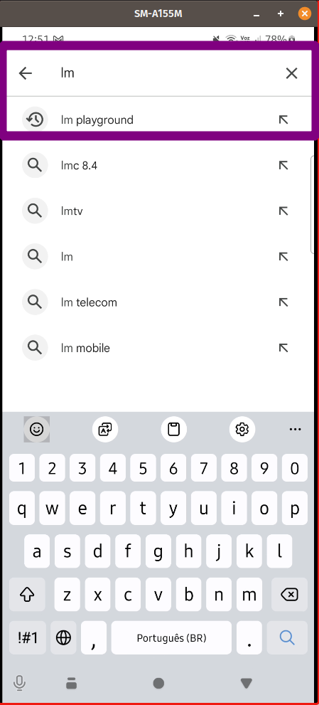
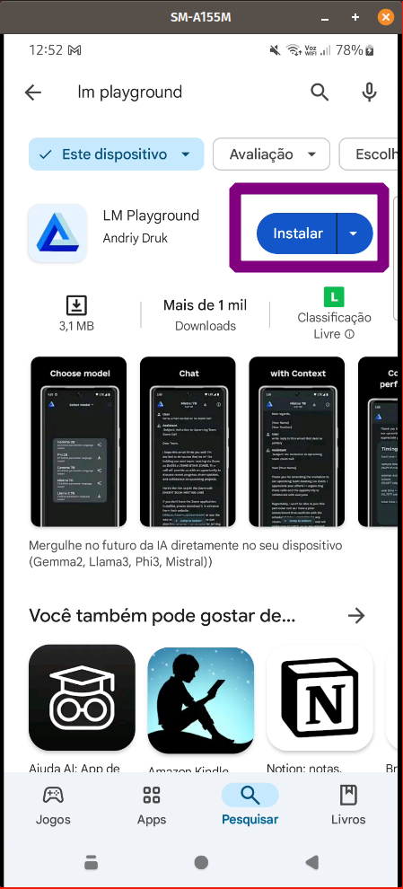
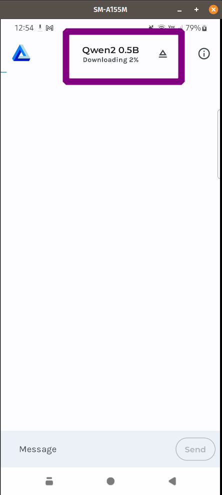
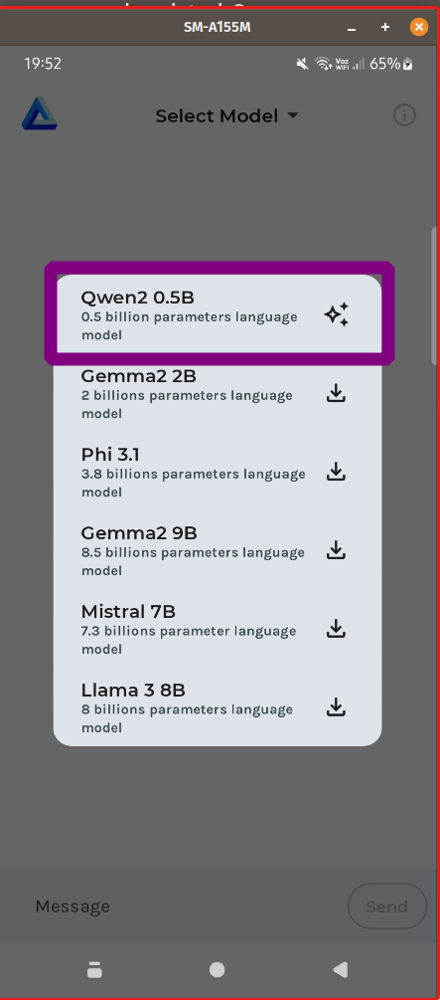
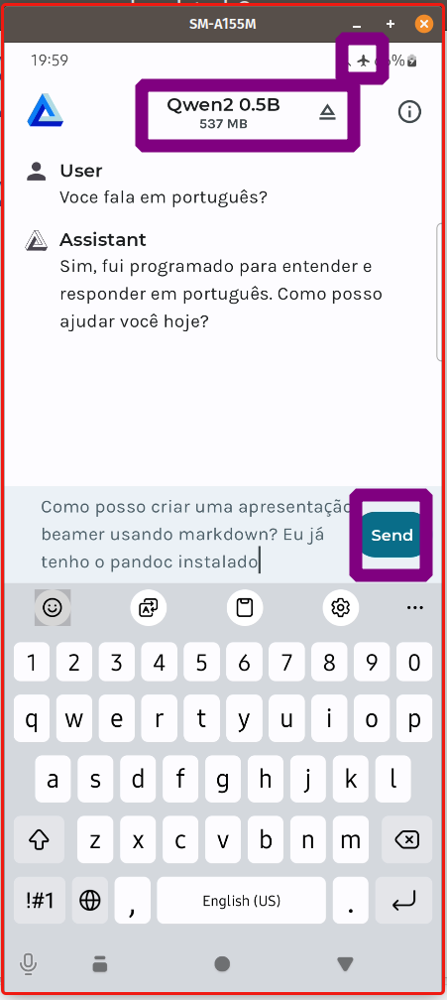
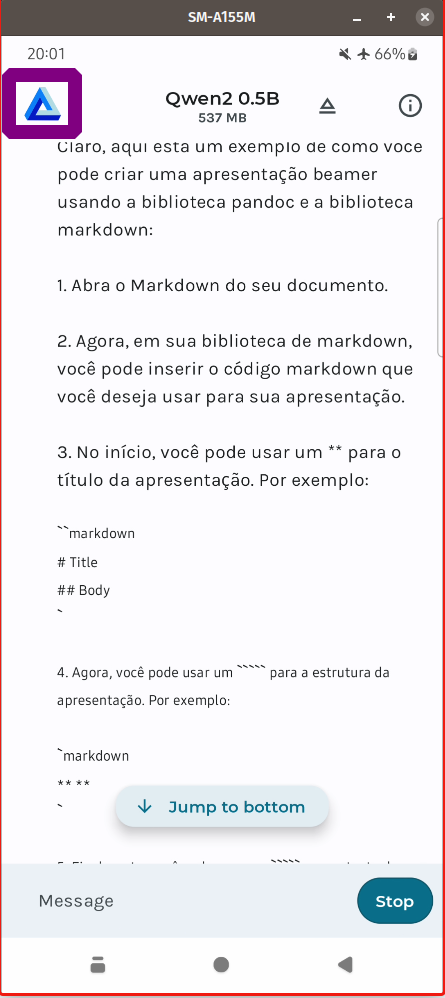
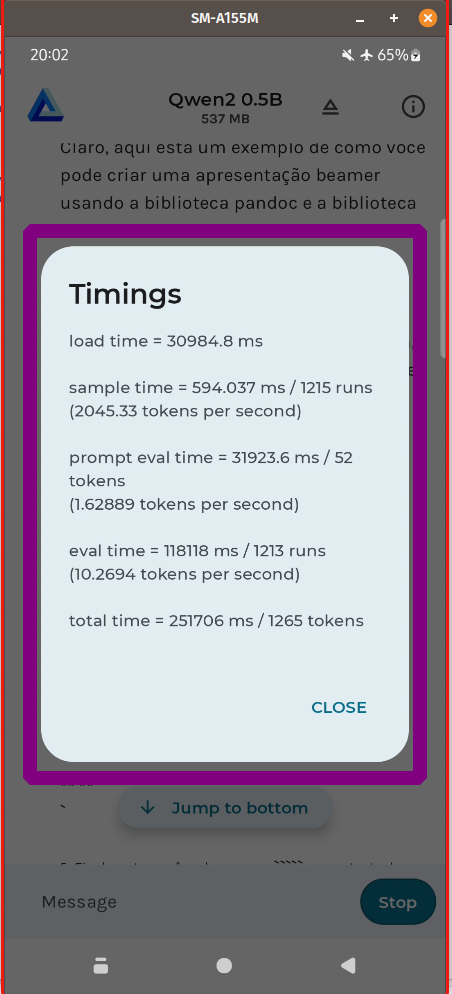
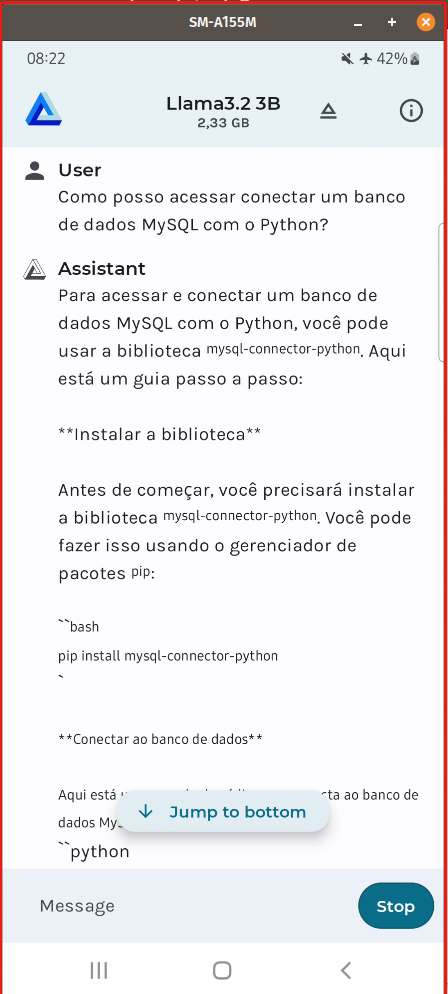
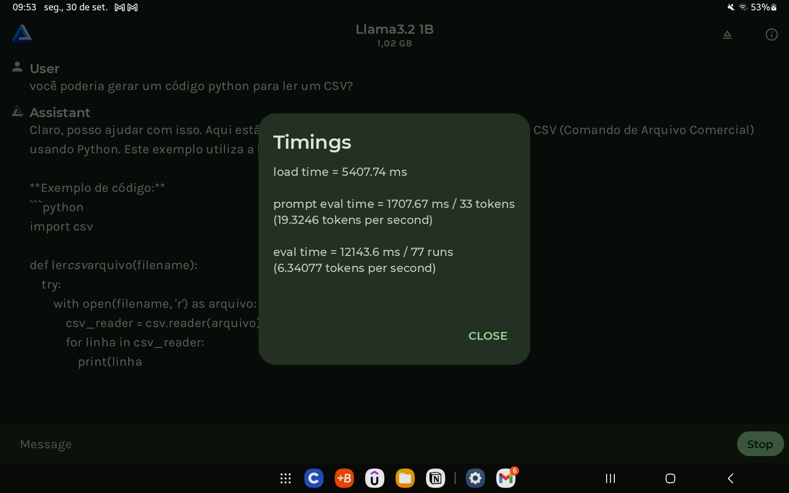

Outros posts sobre o tema em:

[Como Criar um Pipeline em Python para Testar Modelos no Hugging Face](https://lgrando1.github.io/post/hface/)

[Dicas de Engenharia de Prompt](https://lgrando1.github.io/post/prompt1/)

[Parte 1 - Instalando o Ollama no Linux](https://lgrando1.github.io/post/ollama/)

[Parte 2 - Instalando o Ollama no Windows](https://lgrando1.github.io/post/ollamawin/)

[Parte 4 - Instalando LLMs Off-line no Android - pt.2](https://lgrando1.github.io/post/llmtermux/)

[Parte 5 - Quatro Maneiras de Usar LLMs Offline no Seu Computador](https://lgrando1.github.io/post/waysllms)

[Parte 6 - RAG Offline: Usando LM Studio e Ollama para Processar Documentos](https://lgrando1.github.io/post/rag/)

Importante: Nunca utilizar LLMs como oráculos ou como fonte de informações, já encontrei vários erros tanto em modelos online ou offline. Usar apenas como suporte para suas atividades.  

Depois de testar LLMs offlines no computador, resolvi procurar uma solução para meu celular. O dispositivo em questão é um celular Android da Marca Samsung [modelo A15 (SM-A155M/DSN)](https://www.samsung.com/br/smartphones/galaxy-a/galaxy-a15-blue-black-256gb-sm-a155mzkizto/). O mesmo é um dispositivo que me custou um pouco menos de 1000 reais e o possui 8 gigas de RAM, em meus testes a quantidade de RAM influenciou no desempenho, com 8 GB tive sucesso em modelos de no máximo 4B de paramêtros, testei um de 7B e ele ficou muito lerdo para gerar a inferência. Sobre dispositivos com 4 gigas de RAM fiz um teste e descrevo no item 15.

Existe bastante discussões sobre este tema, como por [exemplo em](https://www.reddit.com/r/LocalLLaMA/search/?q=smartphone&type=link&cId=cf9557fb-9775-4a60-8095-c8c0c62a65fa&iId=cc07fcca-916b-44b7-9e36-ddad34b28746) onde conheci este aplicativo, o [LM Playground](https://play.google.com/store/apps/details?id=com.druk.lmplayground).

Lembrando que é uma solução experimental e encontrei vários problemas como demora de respostas e muitas vezes ele alucinava ou não finalizava a inferência. Dependendo o poder computacional do dispositivo onde está sendo realizado o teste, ele pode não conseguir inferir dependendo o modelo LLMs. Testei um Modelo de 7B no meu celular e ele ficou muito lento.
 
Caso queira ver o aplicativo em ação, segue um vídeo que gravei testando o aplicativo:



Para instalar:

1. Entrar na PlayStore:

2. Procurar o Aplicativo "LM Playgroung":

3. Instalar o App:

Para utilizar o Aplicativo:

4. Abrir o App e clicar em "Select Model":

5. Abrira os modelos disponíveis no aplicativo, lembrando que a versão Beta do aplicativo possui mais modelos disponíveis, ver item 13:

6. Clicar em baixar um modelo e esperar baixar:

7. Aparecerá que o modelo foi baixado:

8. O Aplicativo baixa o modelo na pasta de Download, se você quiser apagar um modelo baixado, precisa deletar no seu gerenciador de dispositivos:

9. Para garantir que não ocorra conexão, para fins de teste:

10. Abrir novamente o aplicativo e escolher o modelo:

11. Agora você pode começar a utilizar o modelo como se fosse um chat.

12. Ao clicar no símbolo do aplicativo ou no sinal de exclamação, você pode avaliar a métrica de performance do modelo:

13. Entrei como testador beta do LM Playground e após a atualização do aplicativo apareceu novos modelos LLMs para testar:

14. Testei a [Llama3.2 3B](https://ai.meta.com/blog/llama-3-2-connect-2024-vision-edge-mobile-devices/) e gostei do desempenho em meu celular:

15. testei em um tablet da Samsung (Modelo X200 com 4 GB de RAM) e não tive sucesso com este modelo de Llama3.2 3B, mas aparentemente o Llama3.2 1B funcionou bem, reforçando a questão empírica destes testes:

Sucesso a todos! 

