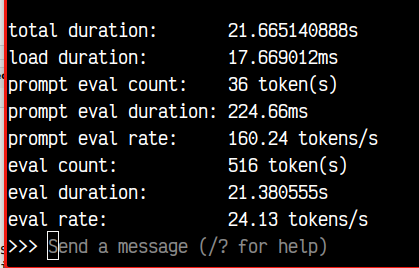
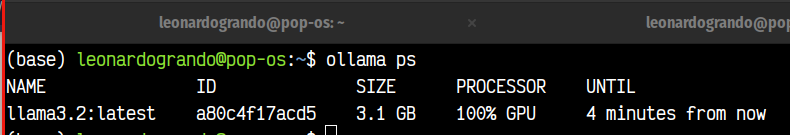
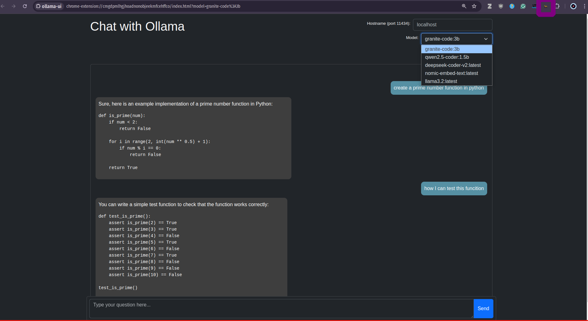
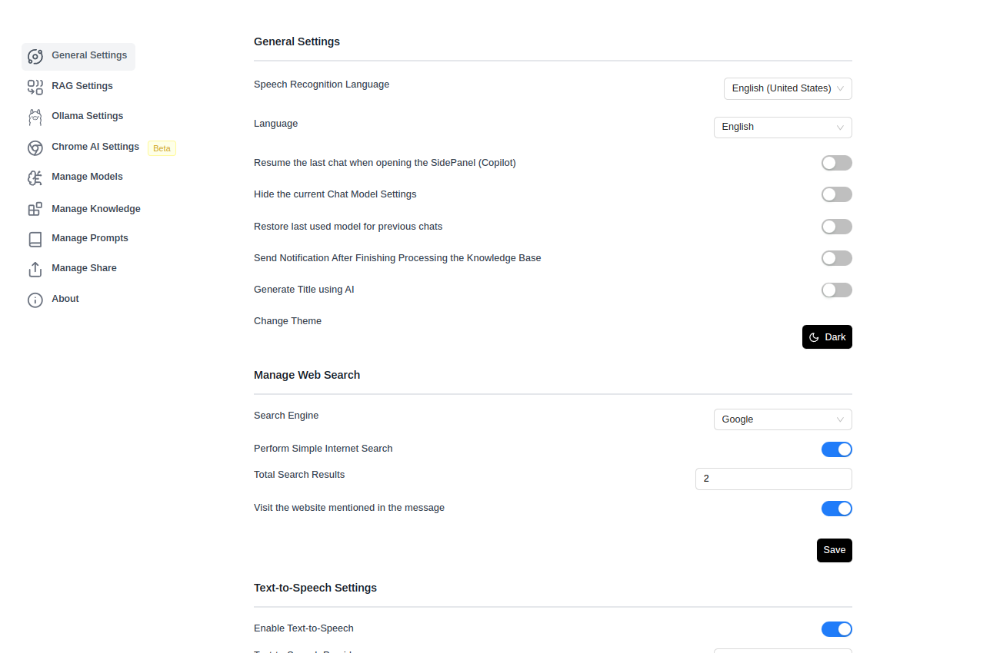
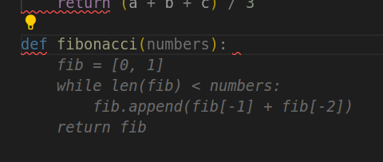
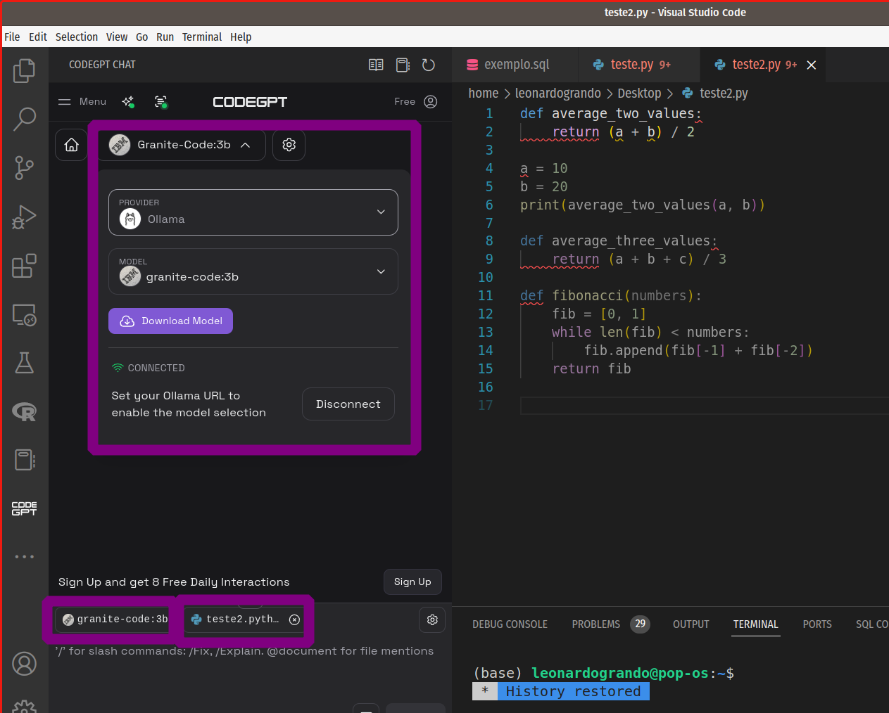
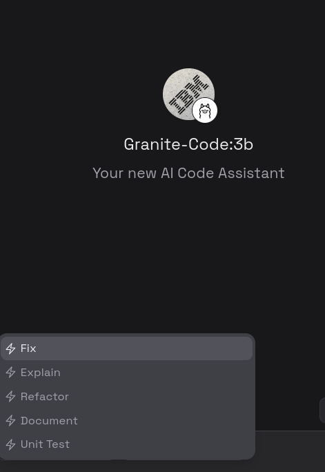

Outros posts sobre o tema:

[Como Criar um Pipeline em Python para Testar Modelos no Hugging Face](https://lgrando1.github.io/post/hface/)

[Dicas de Engenharia de Prompt](https://lgrando1.github.io/post/prompt1/)

[Parte 1 - Instalando o Ollama no Linux](https://lgrando1.github.io/post/ollama/)

[Parte 2 - Instalando o Ollama no Windows](https://lgrando1.github.io/post/ollamawin/)

[Parte 3 - Instalando o Ollama no Android pt.1](https://lgrando1.github.io/post/llmandroid/)

[Parte 4 - Instalando o Ollama no Android pt.2](https://lgrando1.github.io/post/llmtermux/)

[Parte 6 - RAG Offline: Usando LM Studio e Ollama para Processar Documentos](https://lgrando1.github.io/post/rag/)


Neste vídeo, apresento quatro formas de integrar uma LLM offline ao seu fluxo de trabalho:



Lembre-se de que, por rodarem offline, essas aplicações dependem do poder computacional do seu computador, da quantidade de memória RAM e da capacidade de processamento da sua GPU.

Neste vídeo, utilizei um notebook Acer Nitro com CPU Core i5 9300H, 16 GB de RAM e GPU Nvidia GeForce GTX 1650.


**Importante:** Nunca use LLMs como oráculos ou fontes de informação definitiva; já encontrei vários erros em modelos, tanto online quanto offline. Utilize-os apenas como suporte para suas atividades.

## 1. No Terminal:

Acesse e utilize um LLM diretamente pelo terminal com o [Ollama](https://ollama.com/), aproveitando sua flexibilidade e eficiência. Os links acima ensinam como instalá-lo no [Windows](https://lgrando1.github.io/post/ollamawin/), [Linux](https://lgrando1.github.io/post/ollama/), [Android via aplicativo](https://lgrando1.github.io/post/llmandroid/) e [via Termux](https://lgrando1.github.io/post/llmtermux).

Alguns comandos úteis:

1. Para listar os modelos baixados na sua máquina:

```bash
ollama list
```

2. Para rodar/baixar um modelo:

```bash
ollama run <modelo>
```


Para obter informações sobre a performance do modelo em sua máquina, adicione a flag *--verbose*:

```bash
ollama run <modelo> --verbose
```



Para saber qual modelo LLM está rodando no server ollama em determinado momento e se ele está utilizando a CPU ou GPU de seu computador:

```bash
ollama ps
```



Para remover um modelo específico:

```bash
ollama rm <modelo>
```

Para sair do prompt de um modelo, digite:

```bash
/bye
```
ou Control + D.


## 2. Em uma Interface Gráfica (GUI):

Neste exemplo, utilizo a interface disponível em [OpenWebUI](https://openwebui.com/), que instalei via [Docker](https://docs.openwebui.com/getting-started/) para uma experiência mais intuitiva, permitindo fácil alteração e teste de parâmetros do modelo.

Após a instalação do OpenWebUI via [Docker](https://docs.openwebui.com/getting-started/):


Acesse-o em seu navegador em http://localhost:3000/:


Ele solicitará a criação de uma conta para controle de acesso de usuários.

A interface é intuitiva, similar à de outros LLMs online. Basta escolher o modelo e começar a utilizar:


Observe que há controles para modificar os parâmetros do modelo:


## 3. Como Extensão de Navegador:

Utilize o LLM através da [extensão de navegador Chrome](https://chromewebstore.google.com/detail/ollama-ui/cmgdpmlhgjhoadnonobjeekmfcehffco). Confira a [Ollama UI](https://github.com/ollama-ui/ollama-ui) para fácil integração, permitindo escolher entre vários modelos LLM disponíveis no seu computador e salvar seus chats.Para ativá-la, basta clicar no ícone da extensão.



Também testei a extensão [Page-Assist](https://chromewebstore.google.com/detail/page-assist-a-web-ui-for/jfgfiigpkhlkbnfnbobbkinehhfdhndo) cujo código fonte pode ser [encontrado aqui](https://github.com/n4ze3m/page-assist).


Ele também possui mais opções de configurações, inclusive para parametros do Chat:




Também é possivel ativar a função "Copilot", onde ele abre uma janela lateral e uma opção no menu de contexto. Na figura abaixo solicitei para ele traduzir um excerto do texto


Inclusive você pode utilizar recursos de visão com o modelo [MiniCPM-V](https://ollama.com/library/minicpm-v):


Inclusive Reconhecimento Óptico de Caracteres (OCR) de algum screenshot (nos meus testes, funcionou melhor em inglês do que em português):


O vídeo abaixo demostra esta função:



Você pode procurar mais extensões na própria loja de extensões do seu navegador:


## 4. Em Aplicativos como o VSCode:

Existem várias extensões disponíveis para [integrar LLMs a aplicativos como o VS Code, Obsidian, etc](https://github.com/ollama/ollama#extensions--plugins). Neste vídeo, utilizei o [CodeGPT](https://codegpt.co/) no [VS Code](https://marketplace.visualstudio.com/items?itemName=DanielSanMedium.dscodegpt&ssr=false#overview), que proporciona funcionalidades adicionais diretamente no ambiente de desenvolvimento, como auto-complete e um chat integrado com o seu código. Enfrentei algumas dificuldades para encontrar um modelo que funcionasse no meu computador; o único modelo que funcionou para auto-complete foi o Qwen2.5.


Enquanto você escreve código, sugestões aparecem em cinza, e basta pressionar TAB para aceitá-las, como no exemplo de uma função para encontrar números de Fibonacci. No entanto, o processo foi lento na minha máquina:



Você pode verificar o status dos modelos em execução com o comando:

```bash
ollama ps
```


Para o chat integrado, escolha entre vários provedores e modelos, podendo baixar novos modelos conforme necessário. No meu setup, funcionaram o Llama3.2:3B e o Granite-code:3B.



O modelo Granite se destacou, oferecendo comandos como /Fix (corrige seu código), /Explain (explica seu código), /Refactor (refatora seu código), /Document (documenta seu código) e /Unit Test (cria testes unitários para seu código).



Aqui está um exemplo de criação de uma unidade de teste para o código:


Agora, note que estamos usando o modelo Granite:


Lembre-se de que todas essas quatro aplicações ainda são experimentais e devem ser validadas antes de qualquer uso em produção.

Sucesso a todos!
