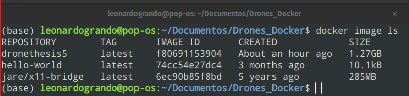
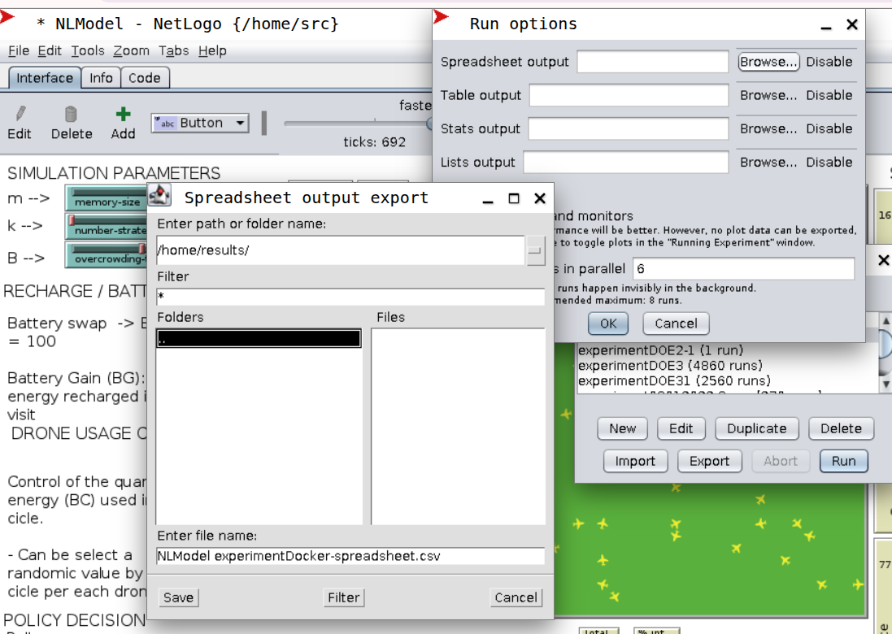

## Introdução  

Fazer ciência é garantir que o seu modelo de simulação possa ser replicado por outros pesquisadores.

O [Guia de boas práticas do CoMSES Network](https://www.comses.net/resources/guides-to-good-practice/) recomenda o uso de containers para reduzir problemas com dependencias de dados e versões

Criando um container, é possível facilitar a publicação dos seus resultados, pois outros pesquisadores poderão ter acesso aos seus experimentos.

Uma das formas de garantir a replicabilidade do seu modelo de simulação baseado em agentes com o NetLogo é criar um container para ele, conforme descrito [neste artigo](https://forum.comses.net/t/containerizing-a-netlogo-model-gui-version/8236)

No entanto, esse artigo já possui cinco anos e não aborda como realizar o processo no Linux, então resolvi testar.

Neste post, refaço o passo a passo do tutorial original e relato as alterações que realizei.

## 0. Pré-requisitos

Você precisa ter o Docker instalado no seu computador. 

No meu caso eu uso o Pop!_OS (LTS 22.04), que é derivado do Ubuntu e usei [este tutorial](https://docs.docker.com/engine/install/ubuntu/#install-using-the-repository). 

Também foi necessário realizar os [procedimento de pós instalação](https://docs.docker.com/engine/install/linux-postinstall/) e reiniciar a máquina.

Com a máquina reiniciada, pude começar a replicar o tutorial

## 1. Determinar o local do arquivo.

Para fins de teste, utilizei o arquivo que empreguei nas simulações do meu doutorado, disponível [aqui:](https://doi.org/10.25824/redu/QGAUPI)

Criei uma pasta chamada ```Drone_Docker``` nos meus documentos, com as subpastas ```results``` e ```src```.

Renomeei o arquivo do NetLogo para ```DronesThesis.nlogo``` e criei um arquivo Dockerfile. 

Neste momento a pasta ```TestResults``` não existia, ela será gerada posteriormente. 


## 2. Incluir extensões adicionais. 

No meu caso, não foi necessário incluir extensões adicionais, então pulei este passo.

## 3. Criar um arquivo Docker (Dockerfile)

Tive que realizar algumas alterações em relação ao código proposto no artigo original.

Em vez de usar o OpenJDK na versão 8, utilizei a versão 11.

Com a versão 8, o modelo não iniciava. Acredito que isso se deva à mudança na [versão 6.3.0 do NetLogo](https://ccl.northwestern.edu/netlogo/docs/versions.html)


```bash

FROM openjdk:11-jdk

ARG MODEL_NAME
ARG NETLOGO_VERSION
ARG NETLOGO_NAME=NetLogo-$NETLOGO_VERSION
ARG NETLOGO_URL=https://ccl.northwestern.edu/netlogo/$NETLOGO_VERSION/$NETLOGO_NAME-64.tgz

ENV LC_ALL=C.UTF-8 \
    LANG=C.UTF-8 \
    DISPLAY=:14
    
RUN mkdir /home/netlogo \
 && wget $NETLOGO_URL \
 && tar xzf $NETLOGO_NAME-64.tgz -C /home/netlogo --strip-components=1 \
 && rm $NETLOGO_NAME-64.tgz \
 && cp /home/netlogo/netlogo-headless.sh /home/netlogo/netlogo-headw.sh \
 && sed -i -e 's/org.nlogo.headless.Main/org.nlogo.app.App/g' /home/netlogo/netlogo-headw.sh \
 && apt-get update && apt-get install -y libxrender1 libxtst6
    
COPY . /home/

RUN mv /home/src/$MODEL_NAME /home/src/NLModel.nlogo

CMD ["/home/netlogo/netlogo-headw.sh", "/home/src/NLModel.nlogo"]

```

## 4. Criar uma imagem Docker 

Agora é o momento de criar a imagem Docker, editei a linha:

```bash
docker build --build-arg MODEL_NAME=yourfile --build-arg NETLOGO_VERSION=yourversion -t imagename .
```

para o meu caso:

```bash
docker build --build-arg MODEL_NAME=DroneThesis.nlogo --build-arg NETLOGO_VERSION=6.4.0 -t dronethesis5.
```

O nome da imagem ficou ```dronethesis5``` (sim, foi a minha quinta tentativa de criar uma imagem funcional).

Se tudo der certo, a imagem será criada. Caso contrário, talvez este [FAQ da postagem original possa ajudar:](https://forum.comses.net/t/containerizing-a-netlogo-model-gui-version/8236#heading--trblshoot):


Observe que uma imagem Docker foi gerada:



## 4. Rodar o container

Como no tutorial original, é necessário rodar outra imagem chamada [docker-x11-bridge](https://hub.docker.com/r/jare/x11-bridge)

```bash
docker run -d --name x11-bridge -e MODE="tcp" -e XPRA_HTML="yes" -e DISPLAY=:14 -e XPRA_PASSWORD=111 -p 10000:10000 jare/x11-bridge
```

E agora sim, executar a imagem contendo o modelo de simulação:

```bash
docker run -d --name netlogo --volumes-from x11-bridge -v path/to/your/results/folder:/home/results imagename
```

No meu caso:


```bash
docker run -d --name netlogo --volumes-from x11-bridge -v /home/leonardogrando/Documentos/Drones_Docker/results/TestResults:/home/results dronethesis5
```

O nome do container ficou como ```netlogo```, a pasta de resultados ficou ```/home/leonardogrando/Documentos/Drones_Docker/results/TestResults``` e a imagem utilizada foi ```dronethesis5``` .

Agora, para acessar o modelo, basta abrir no navegador:

```bash
http://localhost:10000/index.html?encoding=rgb32&password=111
```


## 5. Realizando os experimentos

Agora você pode acessar o BehaviorSpace para realizar o delineamento do experimento:


Ao clicar em ```Run```:


Você podera alterar o local onde o BehaviorSpace irá salvar as planilhas com os resultados (pasta ```results```): 



Assim você poderá acessar os resultados fora do container e realizar a mineração de dados:


# 6. Parando os containers

Para parar os containers, utilize os comandos:

```bash
docker stop netlogo
docker stop x11-bridge
```


E os resultados continuarão na pasta ```results```

## 7. Compartilhando sua imagem no Hub Docker.

Primeiro você precisara ter um login no site Docker.com e terá que logar na sua conta com o comando:


```bash
docker login
```

Depois você terá que criar uma imagem com o seu usuário docker, no meu caso: ```leogrand1```, não esqueça de substituir com o seu usuário Docker:

```bash
docker build --build-arg MODEL_NAME=DroneThesis.nlogo --build-arg NETLOGO_VERSION=6.4.0 -t leogrand1/codigodrones:1.0 .
```
Agora você podera avaliar suas imagens com o comando 

```bash
docker images
```


E por fim subir a versão desejada (não esqueça de substituir com o seu usuário Docker):

```bash
docker image push leogrand1/codigodrones:1.0

```


Agora você pode acessar esta imagem na sua conta do Docker Hub:


Esta imagem está disponível no link: https://hub.docker.com/r/leogrand1/codigodrones

E pode ser obtida pelo comando:

```bash
docker pull leogrand1/codigodrones

```

Para conhecer mais sobre este procedimento de push de imagens docker, [recomendo este tutorial.](https://training.play-with-docker.com/beginner-linux/)

## 8. Conclusão  

Este post não substitui o [post original](https://forum.comses.net/t/containerizing-a-netlogo-model-gui-version/8236/1), sendo que o objetivo aqui é auxiliar pesquisadores que falam português e utilizam Linux. 

## Referencias:

COMSES NET. Guides to Good Practice. Disponível em: <https://www.comses.net/resources/guides-to-good-practice/>. Acesso em: 11 maio 2025.

GRANDO, Leonardo; URSINI, Edson Luiz. Study for optimization of battery consumption for unmanned aerial vehicles. Disponível em: <https://redu.unicamp.br/citation?persistentId=doi:10.25824/redu/QGAUPI>. Acesso em: 10 maio 2025.

**Containerizing a NetLogo model - GUI version.** CoMSES Net Discourse Forums. Disponível em: <https://forum.comses.net/t/containerizing-a-netlogo-model-gui-version/8236/1>. Acesso em: 10 maio 2025.

**Install.** Docker Documentation. Disponível em: <https://docs.docker.com/engine/install/>. Acesso em: 10 maio 2025.

**jare/x11-bridge.** Disponível em: <https://hub.docker.com/r/jare/x11-bridge>. Acesso em: 10 maio 2025.

