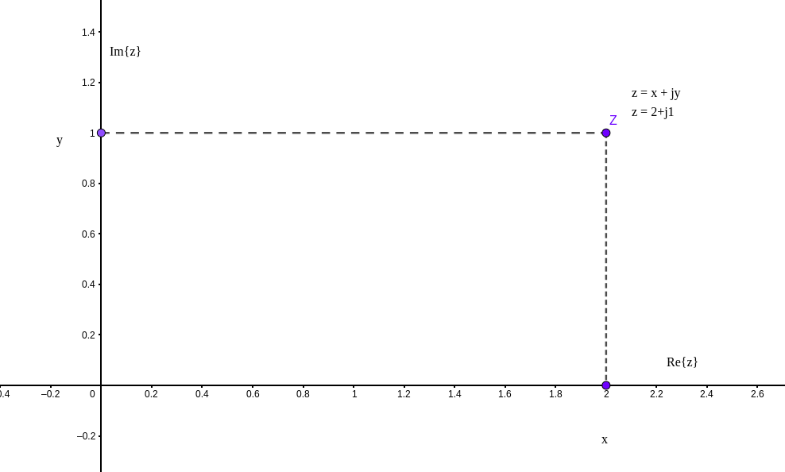
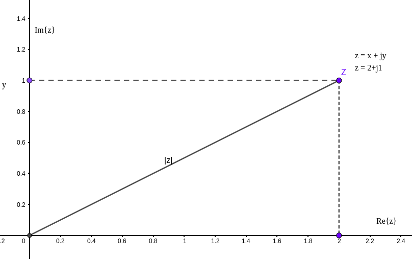

### Pt 1 - Introdução

Nesta série de postagens, trataremos dos números complexos.

Utilizaremos o Python como linguagem de programação.

A Parte 1 deste série considera as operações com as coordenadas cartesianas; 

 1. Números complexos
    
    1.1 - O módulo de um número complexo

    1.2 - O Conjugado de um Número Complexo
    
 3. Operações Básicas

    2.1 - Adição

    2.2 - Subtração

    2.3 - Multiplicação de números complexos

    2.4 - Divisão de números Complexos
    
Código disponível aqui: https://github.com/lgrando1/Notas_Numeros_Complexos/


### 1. Números complexos

Elemento de um sistema numérico que contém os números reais e um elemento especifico denominado $i$, chamado de unidade imaginária, e satisfaz a equação $i^2 = -1$.

#### Plano Complexo

Números complexos são expressões da forma $z = x + iy$ ou $z = x + jy$, onde:

   - $x$ é a parte real de $z$ ou $x = Re$ z;
   - $y$ é a parte imaginária de $z$ ou $y = Im$ z.

A representação cartesiana de um número complexo $z = 2 + j1$:
   

   
O conjunto de números complexos é chamado de plano complexo cujo simbolo é $\mathbb{C}$ e pode ser identificada como $\mathbb{R}^2$.

Os números reais são um conjunto do plano complexo onde a parte imaginaria é zero.

Conforme a biblioteca utilizada no Python, pode-se representar o elemento $i$ como a letra $j$, no caso da biblioteca [cmath](https://docs.python.org/3/library/cmath.html) para representar a parte imaginaria de um número complexo Já a biblioteca [Sympy](https://www.sympy.org/en/index.html) utilizasse a Letra $I$.

Então a o numero $z = 2+3i$ pode ser descrito no Python como:


```python
z = 2 + 3j

print("Representação do número")
print(z) 
```

    Representação do número
    (2+3j)


```python
print("Classe de z")
print(type(z)) 
```

    Classe de z
    <class 'complex'>


Um numero complexo pode ser representado por um ponto no plano complexo $\mathbb{C}$ e o numero $z = 2+3j$ pode ser representado no Python:


```python
print(complex(2,3))
```

    (2+3j)


```python
print("Parte real de z")
print(z.real)
```

    Parte real de z
    2.0


```python
print("Parte complexa de z")
print(z.imag)
```

    Parte complexa de z
    3.0


#### 1.1 - O módulo de um número complexo

O módulo de um número complexo $z = x + iy$ é a distância entre o ponto $z$ e a origem, utilizando o Teorema de Pitágoras: 

$|z| = \sqrt{x^2 + y^2}$



Em Python, pode obter este valor pela função abs(z): 

z = 1+4i 

w = 4+2i


```python
z = 1+4j
w = 4+2j

print(f"O módulo de z é: {abs(z)}")
```

    O módulo de z é: 4.123105625617661


```python
print(f"O módulo de w é: {abs(w)}")
```

    O módulo de w é: 4.47213595499958


#### 1.2 - O Conjugado de um Número Complexo

O conjugado do número complexo $z = x + iy$ é $\overline{z} = x - iy$


Propriedades do conjugado:

$\overline{\overline{z}} = z$

$\overline{z+w} = \bar{z}+\bar{w}$

$\overline{z} = |\overline{z}|$

$z\overline{z} = (x+iy)(x-iy) = x^2+y^2 = |z|²$

$\frac{1}{z} = \frac{\overline{z}}{z\overline{z}}= \frac{\bar{z}}{|z|²}$

$|z \cdot w| = |z|\cdot|w|$

$\overline{(\frac{z}{w})} = \frac{\overline{z}}{\overline{w}}$, quando $w \neq 0$

$|z| = 0$ se e somente se $z = 0$

Para encontrar os valores Reais e imaginários de z, 

podemos fazer $z = \overline{z}$ ou $z = -\overline{z}$, resultando em:

$Re$ z $= \frac{z + \overline{z}}{2}$ 

$Im$ z $= \frac{z - \overline{z}}{2i}$

Para obter o conjugado de um número complexo $z$ em Python: 


```python
z = 3+2j
print(z.conjugate())
```

    (3-2j)


**Algumas desigualdades:**

$-|z|\leq Re$ z $ \leq |z|$ 
 
$-|z|\leq Im$ z $ \leq |z|$

**Desigualdade triangular**
$|z+w| \leq |z| + |w|$

Generalizando:

$|z_1+z_2 + ... z_n| \leq |z_1| + |z_2|+ ... + |z_n|$

**Desigualdade triangular inversa**
$|z-w| \geq |z| - |w|$

### 2. Operações Básicas 

#### 2.1 - Adição

Se $z = x + iy$ e $w = u + iv$, podemos representar z + w como:

$(x + iy) + (u + iv) = (x+u) + i(y+v)$, onde:

- Re$(z+w)$ = Re $z$ + Re $w$ 
- Im$(z+w)$ = Im $z$ + Im $w$


#### 2.2 - Subtração 
Se $z = x + iy$ e $w = u + iv$, podemos representar z - w como:

$(x + iy) - (u + iv) = (x-u) + i(y-v)$, onde:

- Re $(z-w)$ = Re $z$ - Re $w$ 
- Im $(z-w)$ = Im $z$ - Im $w$

Em Python para z = 1+4i e w = 4+2i


```python
z = 1+4j

w = 4+2j

print(f"O valor de z+w é, {z+w}")
print(f"O valor de z-w é, {z-w}")
```

    O valor de z+w é, (5+6j)
    O valor de z-w é, (-3+2j)


#### 2.3 - Multiplicação de números complexos

$(x+iy) \cdot (u-iv) = (xu-yv)+i(xv+yu) \in \mathbb{C}$

Propriedades: 

- Associativas: $(z_1z_2)z_3 = z_1(z_2z_3)$; 
- Comutativas: $z_1z_2 = z_2z_1$; 
- Distributivas: $z_1(z_2+z_3) = z_1z_2+ z_1z_3)$.

Exemplo

a = 2+4j

b = -7+5j

$(2+4j) \cdot (-7+5j) = (2 \cdot -7 - 5 \cdot 4) + j(2 \cdot 5 + 4 \cdot -7)$

$= -34-18j$

Efetuando a multiplicação dos números a, b e c:


```python
a = 2+4j
b = -7+5j
c = 3+2j

print("a * b = ", a * b)
print("a * c = ", a * c)
```

    a * b =  (-34-18j)
    a * c =  (-2+16j)


Verificando se as propriedades são verdadeiras


```python

print("Associativa: (a*b)*c == a*(b*c)")
print((a*b)*c == a*(b*c))
```

    Associativa: (a*b)*c == a*(b*c)
    True


```python
print("Comutativa: a*b == b*a")
print(a*b == b*a)
```

    Comutativa: a*b == b*a
    True


```python
print("Distributiva: a*(b+c) == a*b + a*c")
print(a*(b+c) == a*b + a*c)
```

    Distributiva: a*(b+c) == a*b + a*c
    True


As Potências de $i$:

$i^0 = 1$

$i = 0 + 1i$

$i^2 = (0 + 1i)(0 + 1i) = (0\cdot0 - 1\cdot1) + i(0\cdot1+1\cdot0) = -1$

$i^3 = i^2 \cdot i = -1\cdot i = -i $

$i^4 = i^2 \cdot i^2 = -1\cdot -1 = 1 $

$i^5 = i^4 \cdot i = i $

$i^{100} = (i^4)^{25} = (1)^{25} = 1 $


#### 2.4 - Divisão de números Complexos 

Considere os números complexos $z = x + iy$ e $w = u + iv$,

Para efetuar a divisão $ \frac{z}{w} $, para $w \neq 0$, 

multiplica o numerador e o denominador pelo conjugado complexo do denominador. 

$\frac{z}{w} = \frac{x+iy}{u+iv} = \frac{(x+iy)(u-iv)}{(u+iv)(u-iv)} = \frac{(xu+yv)+i(-xv+yu)}{u^2+v^2 + i(-uv+vu)}$

$\frac{z}{w}$ = $\frac{xu+yv}{u^2+v^2}+i \frac{yu-xv}{u^2+v^2 }$

Desta forma:

$\frac{1}{z} = \frac{1}{x+iy} = \frac{x-iy}{x^2+y^2}$, quando $z \neq 0$ 


Para $a = 2+4j$ e $b = -7+5j$

$\frac{a}{b} = \frac {2 \cdot -7 + 4 \cdot 5}{-7^2+5^2}+i \frac{4 \cdot -7-2 \cdot 5}{-7^2+5^2} = 0.08108-i0.5135$

No Python:


```python
a = 2+4j
b = -7+5j
c = 3+2j

print("a / b = ", a / b)
print("a / c = ", a / c)

```

    a / b =  (0.08108108108108109-0.5135135135135136j)
    a / c =  (1.0769230769230769+0.6153846153846155j)


### Referências Bibliográficas

**CMATH — MATHEMATICAL FUNCTIONS FOR COMPLEX NUMBERS.** 2023. Python documentation. Disponível em: https://docs.python.org/3/library/cmath.html. Acesso em: 19 ago. 2023.


MEURER, Aaron; SMITH, Christopher P.; PAPROCKI, Mateusz; ČERTÍK, Ondřej; KIRPICHEV, Sergey B.; ROCKLIN, Matthew; KUMAR, AMiT; IVANOV, Sergiu; MOORE, Jason K.; SINGH, Sartaj; RATHNAYAKE, Thilina; VIG, Sean; GRANGER, Brian E.; MULLER, Richard P.; BONAZZI, Francesco; GUPTA, Harsh; VATS, Shivam; JOHANSSON, Fredrik; PEDREGOSA, Fabian; … SCOPATZ, Anthony. **SymPy: symbolic computing in Python**. PeerJ Computer Science, v. 3, p. e103, 2 jan. 2017. https://doi.org/10.7717/peerj-cs.103.

GEOGEBRA. 2023. **GeoGebra**. Disponível em: https://www.geogebra.org/. Acesso em: 19 ago. 2023.


LUCIO S. BUSTAMANTE, F. **Números complexos com Python e SymPy**. Disponível em: <https://cienciaprogramada.com.br/2022/03/numeros-complexos-python-sympy/>. Acesso em: 1 ago. 2023.

PETRA, B.-T. **Introdução à análise complexa**. Disponível em: <https://www.coursera.org/learn/complex-analysis>. Acesso em: 8 Mai. 2023.

URSINI, Edson L. **Notas de Aulas TT413 - Métodos Matemáticos para Telecomunicacões.** [S. l.: s. n.], 2023.‌


