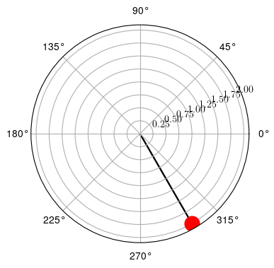
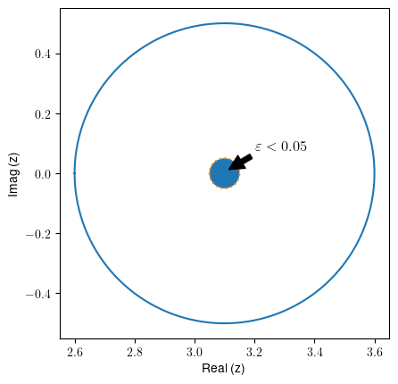
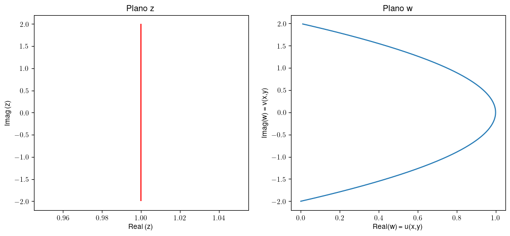

```python
#importar as bibliotecas
import matplotlib.pyplot as plt
import numpy as np
import cmath

plt.rcParams.update({
    "text.usetex": True,
    "font.family": "sans-serif",
    "font.sans-serif": "Helvetica",
})

#import sympy 
from sympy import I, re, im, Abs, arg, conjugate, solve, Symbol, deg, sqrt

from sympy import exp, sin, cos, symbols
from sympy import exp_polar, pi, I, sqrt

```


```python
# função para plotar o número - Modificado para o Sympy

def plotapolar(z):
    fig, ax = plt.subplots(subplot_kw={'projection': 'polar'}, figsize=(4, 4))
    ax.plot(arg(z), abs(z), marker='o', markersize=15, color='red')
    ax.quiver(0, 0, float(re(z)), float(im(z)), scale=0.1)
    plt.show()
```

## Lista com exercícios envolvendo números complexos

Códigos disponíveis [aqui](https://github.com/lgrando1/Notas_Numeros_Complexos)

## 1. Expresse $1-\sqrt{3}i$ na forma polar (faça o gráfico) 


```python
z = 1-sqrt(3)*I
z
```


$\displaystyle 1 - \sqrt{3} i$


```python
abs(z)
```


$\displaystyle 2$


```python
arg(z)
```


$\displaystyle - \frac{\pi}{3}$


```python
plotapolar(z)
```


    

    


## 2. Faça o gráfico de $|z-(1.1+2i)|<0.05$

Expandindo resulta em uma equação da reta,

$\sqrt{(x-1.1)^2+(y-2)^2} < 0.05$

O gráfico abaixo mostra os pontos (pintados) para os pontos solicitados.


```python
# ponto central do circulo
z = 1.1 + 2
  
theta = np.linspace( 0 , 2 * np.pi , 150 ) 

#raio do circulo maior, apenas para referencia
radius = 0.5 
#raio do circulo menor
radius1 = 0.05

# Desenhando o circulo maior
a = float(re(z)) - radius * np.cos( theta ) 
b = float(im(z)) - radius * np.sin( theta ) 
# Desenhando o circulo menor, aberto
a1 = float(re(z)) - radius1 * np.cos( theta ) 
b1 = float(im(z)) - radius1 * np.sin( theta ) 

# Pintando a area desejada 
Drawing_colored_circle = plt.Circle(( float(re(z)) , float(im(z)) ), radius1 )

# Plotando a figura:
figure, axes = plt.subplots( 1 ) 
axes.plot( a, b )
axes.plot( a1, b1 , linestyle = 'dotted')
axes.add_artist( Drawing_colored_circle ) 
axes.set_aspect( 1 ) 


axes.set_xlabel("Real (z)")
axes.set_ylabel("Imag (z)")

#para criar a anotação e a seta indicativa
axes.annotate(r'$\varepsilon < 0.05$', (float(re(z))+0.01, float(im(z))+0.01),
            xytext=(0.75, 0.6), textcoords='axes fraction',
            arrowprops=dict(facecolor='black', shrink=0.05),
            fontsize=12,
            horizontalalignment='right', verticalalignment='top')

#plt.title( 'Parametric Equation Circle' ) 

plt.show() 
```


    

    


## 3 - Faça o gráfico de $\Re(z) \geq 1$

se $z = x + yi$

Então $\Re(z) = x$ e desta forma seria a área maior e igual a 1. 

São os pontos ilustrados abaixo:


```python
# Código apenas para representação:

fig, ax = plt.subplots()
plt.vlines(x=1, ymin = 0, ymax = 2, color='r', linestyle='solid')

ax.set(xlim=(0, 2), xticks=np.arange(0, 2),
       ylim=(0, 2), yticks=np.arange(0, 2) )

y = np.array([0, 2])
x1 = np.array([2,2])
x2 = np.array([1,1])

ax.set_xlabel("Real (z)")
ax.set_ylabel("Imag (z)")

ax.fill_betweenx(y, x1, x2, where=(x1 > x2), color='C0', alpha=0.3)

plt.show() 
```


    

    


## 4 - Ache a imagem da linha $Re(z) = 1$ sob o plano $f(z) = z^2$. Onde $f(z)$ dá origem à imagem em $f(w)$. Faça o gráfico

$w = f(z) = z^2 = (x+yi)^2 = x^2-y^2+2xyi$

$u = x^2-y^2$
$v = 2xy$

Como $\Re(z) = x$ então neste caso para $x = 1$

Resultando em:

$v = 2y \rightarrow \frac{v}{2}$

$u = 1-y^2 \rightarrow 1- \frac{v^2}{4}$


```python
plt.figure(figsize = ((12,5)))
           
ax1 = plt.subplot(1,2,1)
ax2 = plt.subplot(1,2,2)
ax1.vlines(x=1, ymin = -2, ymax = 2, color='r', linestyle='solid')
ax1.set_title("Plano z")
ax1.set_xlabel("Real (z)")
ax1.set_ylabel("Imag (z)")

v = np.arange(-2, 2, 0.01)
u = 1 - (v**2)/4

ax2.plot(u,v)
ax2.set_title("Plano w")
ax2.set_xlabel("Real(w) = u(x,y)")
ax2.set_ylabel("Imag(w) = v(x,y)")

```


    Text(0, 0.5, 'Imag(w) = v(x,y)')


    

    


## 5. Diferencie:

Lembrando:

Suponha que $f$ e $g$ são diferenciaveis em $z$, e $h$ é diferenciavel em $f(z)$. Sendo $c \in 	\mathbb{C}$    

 1 - $(cf)'(z) = cf'(z)$;
 
 2 - $(f+g)'(z) = f'(z)+g'(z)$;

 3 - Regra do Produto:
 
 $(f \cdot g)'(z) = f'(z)g(z)+f(z)g'(z)$;
 
 4 - Regra do quociente:
 
 $(\frac{f}{g})'(z) = \frac{g(z)f'(z)-f(z)g'(z)}{g(z)^2}$, para $g(z) \neq 0$;

 5 - Regra da cadeia: 
 
 5 - $(h \circ f)'(z) = h'(f(z))f'(z)$.


a) $f(z) = 3z^4-5z^3+2z$


```python
import sympy
x, y, a, b, c, z = sympy.symbols('x y a b c z')
expr = 3*z**4-5*z**3+2*z
expr
```


$\displaystyle 3 z^{4} - 5 z^{3} + 2 z$


```python
# Importar o módulo de derivadas
from sympy import diff
```


```python
diff(expr,z)
```


$\displaystyle 12 z^{3} - 15 z^{2} + 2$


b) $f(z) = \frac{z^2}{4z+1}$

Para resolver, não esquecer:
1. Utilizar a regra do quociente
2. lembrar que $g(z) \neq 0$


```python
exp1 = z**2 / (4*z+1)
exp1
```


$\displaystyle \frac{z^{2}}{4 z + 1}$


```python
diff(exp1,z)
```


$\displaystyle - \frac{4 z^{2}}{\left(4 z + 1\right)^{2}} + \frac{2 z}{4 z + 1}$


Para $z \neq -\frac{1}{4}$

## 6. Mostre que $f(z) = x + 4iy$ não é diferenciável em nenhum ponto;

*Forma 1 - Teorema de Cauchy-Reimann*

u = x

y = 4i


```python
u = x
v = 4*y
```


```python
diff(u,x) == diff(v,y)
```


    False


```python
diff(u,y) == -diff(v,x)
```


    True


*Forma 2 - Fazendo $\Delta z = \Delta x + i \Delta y$*

Portanto: 

$\lim_{\Delta z \to 0} \frac{ f(z+\Delta z)-f(z)}{\Delta z}$

Resultando em:

$f(z + \Delta z) - f(z) = x + \Delta x  + 4i(y+ \Delta y) - x - 4iy = \Delta x + 4i \Delta y$ 

e

$\lim_{\Delta z \to 0}\frac{\Delta x + 4i\Delta y}{\Delta x + i\Delta y}$

Quando $\Delta z \to 0$ ao longo de uma linha paralela ao eixo x, então $\Delta y\to 0$ e o limite tende a 1. 

Quando $\Delta z \to 0$ ao longo de uma linha paralela ao eixo y, então $\Delta x\to 0$ e o limite tende a 4.

Portanto, $f(z)$ não é diferenciável em nenhum ponto z. 

## 7 - Verifique se $f(z) = z^2+z$ é analítica.

Uma função $f$ é analitica em um conjunto aberto $U \subset \mathbb{C}$ se f é diferenciavel em cada ponto $z \in U$.

Exemplos:

- Funções polinomiais são analíticas em $\mathbb{C}$;
- Funções racionais $\frac{p(z)}{q(z)}$ são analíticas desde que $q(z) \neq 0$;
- $f(z) = \Re z$ não é analítica;
- $f(z) = \bar{z}$ não é analítica;

Testando as condições de Cauchy-Riemann

Sendo $f=u+iv$ definida no domínio $D \in \mathbb{c}$. Então $f$ é analítica em D se e somente se $u(x,y)$ e $v(x,y)$ possuam a primeira derivada parcial que satisfação as equações de Cauchy-Riemann  


```python
eq3 = (x+I*y)**2 + (x+I*y)
eq3.expand()
```


$\displaystyle x^{2} + 2 i x y + x - y^{2} + i y$


```python
u = x**2-y**2+x
v = 2*x*y + y
```


```python
diff(u,x) == diff(v,y)
```


    True


```python
diff(u,y) == -diff(v,x)
```


    True


## 8 - Verifique se $f(z) = 2x^2+y+i(y^2-x)$ é analítica

Sendo $u = 2x^2 + y$ e $v = y^2-x$

Aplicando Cauchy-Reimann:


```python
u = 2*x**2 + y
v = y**2 - x
```


```python
diff(u,x) == diff(v,y)
```


    False


```python
diff(u,y) == -diff(v,x)
```


    True


Para que as equações de Cauchy-Riemann sejam satisfeitas, é necessário que $y = 2x$ (que é uma linha). pois: 


```python
diff(u,x)
```


$\displaystyle 4 x$


```python
diff(v,y)
```


$\displaystyle 2 y$


Entretanto, para qualquer $z$ nesta linha não haverá vizinhança ou disco aberto em torno de $z$ para o qual $f(z)$ seja diferenciável. Concluímos que $f(z)$ não é analítica em todo domínio.

## 9 - Verifique se $u(x,y) = x^3 - 3xy^2-5y$ é harmômica em todo plano complexo. Ache a função conjugada harmônica de $u(x,y)$, ou seja, $v(x,y)$.

Relembrando: 
Se $f(z) = u(x,y) + iv(x,y)$ é analítica em todo domínio D, então tanto $u$ quanto $v$ satisfazem a equação de Laplace:

$\nabla ^ 2 u = u_{xx} + u_{yy} = 0$ e $\nabla ^ 2 v = v_{xx} + v_{yy} = 0$ em $D$ e têm derivadas segundas parciais contínuas em $D$.

Para verificar se a função é harmônica:


```python
u = x**3-3*x*y**2-5*y

#uxx+uyy = 0
diff(u,x,2) + diff(u,y,2)
```


$\displaystyle 0$


Lembrando das condições de Cauchy-Reimann:

$\frac{\partial u}{\partial x} = \frac{\partial v}{\partial y}$

$\frac{\partial u}{\partial y} = -\frac{\partial v}{\partial x}$


```python
ux = diff(u,x)
ux
```


$\displaystyle 3 x^{2} - 3 y^{2}$


```python
uy = diff(u,y)
uy
```


$\displaystyle - 6 x y - 5$


Desta forma:

(1) $\frac{\partial v}{\partial y} = 3x^2-3y²$

(2) $\frac{\partial v}{\partial x} = 6xy+5$


```python
#Para integrar:
from sympy import integrate, Function, dsolve, Eq

v1 = integrate(ux,y)
v1
```


$\displaystyle 3 x^{2} y - y^{3}$


Observe que a resposta fornecida pelo software não contempla a constante de integração, que inclusive pode ser dependente de x. Esta constante pode ser representada como uma função h(x):

$v(x,y) = 3x^2y-y^3+h(x)$ (3)

Derivando em função de x e igualando a (2):

$\frac{\partial v}{\partial x} = 6xy + h'(x) = 6xy+5 \rightarrow h'(x) = 5$

Então:

$\frac{\partial h}{\partial x} = 5 \rightarrow \int \partial h = 5\int \partial x \rightarrow h = 5x + C$

Resultando em

$v(x,y) = 3x^2y-y^3+5x + C$

A função analítica é:

$f(x,y) = (x^3 - 3xy^2-5y) + i(3x^2y-y^3+5x + C) $ 


## 10 - Quanto vale $\sin(2+i)$ na forma $x + yi$?

Formas trigonométricas, relembrando:

$\cos (z) = \frac{e^{iz}+e^{-iz}}{2}$

$\sin (z) = \frac{e^{iz}-e^{-iz}}{2i}$

Propriedades:

 - $\cos (-z) = \frac{e^{-iz}+e^{iz}}{2} = \cos (z)$

 - $\sin (-z) = \frac{e^{-iz}-e^{iz}}{2i} = -\sin (z)$

 - $\cos(z+w) = \cos(z)\cos(w) - \sin(z)\sin(w)$
   
 - $\sin(z+w) = \sin(z)\cos(w) - \cos(z)\sin(w)$

 - $\cos (z+2\pi) = \frac{e^{i(z+2\pi)}+e^{-i(z+2\pi)}}{2} = \cos(z)$

 - $\sin (z+2\pi) = \sin z$

 - $\sin^2 z + \cos^2 z = 1$

 - $\sin(z + \frac{\pi}{2}) = cos z$

 - $\sin z = 0 \rightarrow z = k\pi, k \in \mathbb{Z}$

 - $\cos z = 0 \rightarrow z = \frac{\pi}{2}+k\pi, k \in \mathbb{Z}$

 - $\sin z = \sin(x + iy) = \sin(x)\cos(iy) + \cos(x)\sin(iy) = \sin(x) \frac {e^y + e^{-y}}{2} + i \cos(x) \frac { e^y-e^{-y}}{2} = \sin x \cosh y + i \cos x \sinh y$

 - $\cos z = \cos x \cosh y - i \sin x \sinh y$

Derivadas:

 - $\frac{d}{dz}\sin z = \cos z$
 
 - $\frac{d}{dz}\cos z = - \sin z$ 


```python
# Para efetuar o calculo de forma numérica, utiliza-se o argumento N: 
from sympy import N
#https://docs.sympy.org/latest/modules/evalf.html#numerical-evaluation

N(sin(2+I))
```


$\displaystyle 1.40311925062204 - 0.489056259041294 i$


```python
#Ou aplicando a formulas acima.

sin(2+I).as_real_imag()
```


    (sin(2)*cosh(1), cos(2)*sinh(1))


## 11 - Ache quanto vale $z$ em $cos(z) = 10$?

Lembrando que:

$\cos(z) = \frac{e^{iz}+e^{-iz}}{2} = 10 \rightarrow e^{2iz}-20e^{iz}+1 = 0$ 

Fazendo $x = e^{iz}$ e resolvendo a equação do segundo grau, resulta em:

$e^{iz} = 10 \pm 3\sqrt{11}$

Obtendo o logaritmo natural, lembrando:

Para $z \neq 0$ e $\theta = arg(z) \rightarrow ln(z) = ln|z| + i(\theta + 2n\pi i)$, onde $(n = 0,\pm 1, \pm 2,...)$:

$iz = ln(10 \pm 3 \sqrt {11} ) \pm 2n\pi i \rightarrow z = ln(10 \pm 3 \sqrt {11} )i \pm 2n\pi$

Como $ln(10 + 3 \sqrt {11} )i$ = $-ln(10 - 3 \sqrt {11} )i$

$z = 2n\pi \pm ln(10 + 3 \sqrt {11} )i$

Numericamente:


```python
from sympy import acos, asin, ln

N(2*pi+ln(10+3*sqrt(11))*I)
```


$\displaystyle 6.28318530717959 + 2.99322284612638 i$


Forma 2 - Utilizando o Sympy para resolver:


```python
equat = cos(z) - 10

solve(equat)
```


    [2*pi - acos(10), acos(10)]


```python
#Numericamente:

N(2*pi-acos(10))  
```


$\displaystyle 6.28318530717959 - 2.99322284612638 i$


## 12 - Ache todos os valores possíveis do $arcsin(\sqrt{5})$?

A função arcoseno é a solução da equação:

$z = \sin w = \frac{e^{iw}-e^{-iw}}{2i}$

Fazendo $v = e^{iw}$ e multiplicando os termos por v, obtemos a equação quadrática para v:

$v^2-2izv-1 =0$

Resolvendo:

$v = iz+(1-z^2)^{1/2} \rightarrow e^{iw} = iz+(1-z^2)^{1/2} \rightarrow w = \arcsin(z) = -iln[iz+1(1-z^2)^{1/2}]$ 

$\arcsin(\sqrt{5}) = -iln[i\sqrt5+1(1-\sqrt5 ^2)^{1/2}] = -iln[(\sqrt5 \pm 2)i] = -i[ln(\sqrt5 \pm 2)+(\frac{\pi}{2}+2n\pi)i] ^{[1]}$ 

$^{[1]} ln(i) = i(\frac{\pi}{2}+2n\pi)$, para $n = 0, \pm 1, \pm 2, ...$

$-iln(\sqrt5 \pm 2) + (\frac{\pi}{2}+2n\pi)$, para $n = 0, \pm 1, \pm 2,...$


Para n = 0


```python
N(-I*(ln(5**0.5+2))+(pi/2))
```


$\displaystyle 1.5707963267949 - 1.44363547517881 i$


```python
#utilizando o sympy
N(asin(5**0.5))
```


$\displaystyle 1.5707963267949 - 1.44363547517881 i$


## 13 - Ache as derivada de $w = arcsin(z)$ no ponto $z = \sqrt{5}$

$w = \sin^{-1}z \rightarrow z = \sin(w) \rightarrow \frac{d}{dz}z = \frac{d}{dz}\sin(w) \rightarrow 1.dz = \cos(w)dw \rightarrow \frac{dw}{dz} = \frac{1}{\cos(w)}$

lembrando que $\cos^2w + \sin^2w = 1$ e $z = \sin w \rightarrow \cos w = (1 - z^2)^{1/2}$

$\frac{d}{dz}\sin^-1(z)= \frac{dw}{dz} = \frac{1}{(1-z^2)^{1/2}}$

$\frac{dw}{dz}|z = \sqrt(5) = \frac{dw}{dz} = \frac{1}{(\sqrt{1-\sqrt{5}^2}} = \frac{1}{2i} = -\frac{i}{2}$


```python
#Forma 2 - Sympy
from sympy import *

exp = diff(asin(z))

exp
```


$\displaystyle \frac{1}{\sqrt{1 - z^{2}}}$


```python
exp.subs(z, 5**0.5)
```


$\displaystyle - 0.5 i$


## 14 - Ache todos os valores de $arc(cosh(-1))$?

$cosh^{-1} z = \ln [z + \sqrt{(z^2-1)}]$

$cosh^{-1}(-1) = \ln(-1) = ln(1) + \pi i + 2n\pi i = \pi i + 2n\pi i, n = 0, \pm1, \pm2,...$


```python
#validando no Sympy:
acosh(-1)
```


$\displaystyle i \pi$


## Referências Bibliográficas

HABER, Howard. **Notas de Aula - Physics 116A - Winter 2010**. 2010. Physics 116A Home Page---Winter 2010. Disponível em: https://scipp.ucsc.edu/~haber/archives/physics116A10/. Acesso em: 8 set. 2023.

MEURER, Aaron; SMITH, Christopher P.; PAPROCKI, Mateusz; ČERTÍK, Ondřej; KIRPICHEV, Sergey B.; ROCKLIN, Matthew; KUMAR, AMiT; IVANOV, Sergiu; MOORE, Jason K.; SINGH, Sartaj; RATHNAYAKE, Thilina; VIG, Sean; GRANGER, Brian E.; MULLER, Richard P.; BONAZZI, Francesco; GUPTA, Harsh; VATS, Shivam; JOHANSSON, Fredrik; PEDREGOSA, Fabian; … SCOPATZ, Anthony. **SymPy: symbolic computing in Python**. PeerJ Computer Science, v. 3, p. e103, 2 jan. 2017. https://doi.org/10.7717/peerj-cs.103.

PETRA, B.-T. **Introdução à análise complexa**. Disponível em: <https://www.coursera.org/learn/complex-analysis>. Acesso em: 8 Mai. 2023.

URSINI, Edson L. **Notas de Aulas TT413 - Métodos Matemáticos para Telecomunicacões.** [S. l.: s. n.], 2023.


```python
N(ln(10+3*sqrt(11)))
```


$\displaystyle 2.99322284612638$


```python
asin(sqrt(5)).
```


$\displaystyle \operatorname{asin}{\left(\sqrt{5} \right)}$


```python

```


```python
N(ln(10-3*sqrt(11)))
```


$\displaystyle -2.99322284612638$


