Outros posts sobre o tema em:

[Como Criar um Pipeline em Python para Testar Modelos no Hugging Face](https://lgrando1.github.io/post/hface/)

[Dicas de Engenharia de Prompt](https://lgrando1.github.io/post/prompt1/)

[Parte 1 - Instalando o Ollama no Linux](https://lgrando1.github.io/post/ollama/)

[Parte 2 - Instalando o Ollama no Windows](https://lgrando1.github.io/post/ollamawin/)

[Parte 3 - Instalando o Ollama no Android pt.1](https://lgrando1.github.io/post/llmandroid/)

[Parte 5 - Quatro Maneiras de Usar LLMs Offline no Seu Computador](https://lgrando1.github.io/post/waysllms)

[Parte 6 - RAG Offline: Usando LM Studio e Ollama para Processar Documentos](https://lgrando1.github.io/post/rag/)

Importante: Nunca utilizar LLMs como oráculos ou como fonte de informações, já encontrei vários erros tanto em modelos online ou offline. Usar apenas como suporte para suas atividades.  

Após o [teste com o aplicativo](https://lgrando1.github.io/post/llmandroid/) [LM Playground](https://play.google.com/store/apps/details?id=com.druk.lmplayground) descobri que é possível rodar LLMs locais como descrito em [1](https://medium.com/@researchgraph/how-to-run-llama-3-2-on-android-phone-64be7783c89f) e [2](https://gitlab.com/-/snippets/3682973) no Android utilizando o [Termux](https://termux.dev/en/) que é um emulador de terminal Android e aplicativo de ambiente Linux que funciona diretamente sem necessidade de root ou configuração. Ao instalar ele vem com um sistema base mínimo, mas você pode instalar adicionais pelo gerenciador de pacotes APT. De forma resumida, você tem uma instalação Linux em seu celular. 

O Termux voltou a estar disponivel na [PlayStore](https://wiki.termux.com/wiki/Termux_Google_Play), mas eu não tive sucesso ao tentar executar o Ollama na versão instalada por lá, como é uma versão experimental pode ser que futuramente funcione. 

Também é possível instalar o Termux via [F-Droid](https://github.com/termux/termux-app#f-droid) ou pelo próprio repositório deles no [GitHub](https://github.com/termux/termux-app#github). Acabei escolhendo a instalar via GitHub. Não detalharei o processo de instalação, por depender da execução de [sideloading](https://en.wikipedia.org/wiki/Sideloading) e cada marca/aparelho/versão tem seu procedimento. Lembrando que instalar aplicativos fora da Google Play não é um procedimento oficial, então faça por sua conta e risco e sugiro apenas fazer se souber o que você está fazendo. 

Para o meu caso, onde estou utilizando um dispositivo Samsung A15:

No vídeo eu mostro o funcionamento dele no meu dispositivo para dois modelos LLMs.



1. Baixei a [ultíma versão estável](https://github.com/termux/termux-app/releases/tag/v0.118.1) e fiz a instalação via sideload no meu dispositivo:

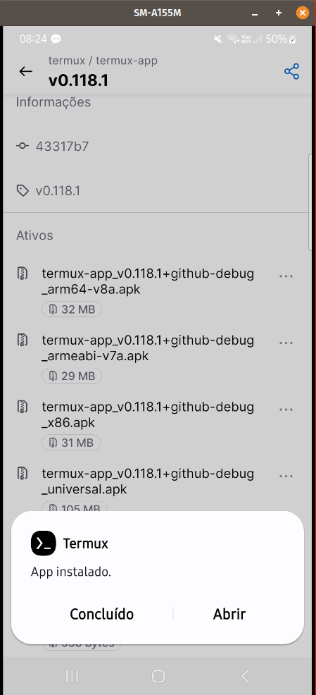

2. Executei a aplicação e apareceu a tela inicial do "Termux":

3. Para permitir que o termux tenha acesso ao armazenamento do dispositivo, utilizei o comando abaixo:

~~~bash
termux-setup-storage
~~~

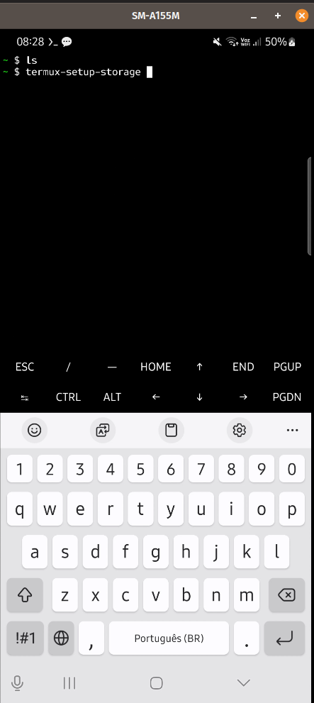
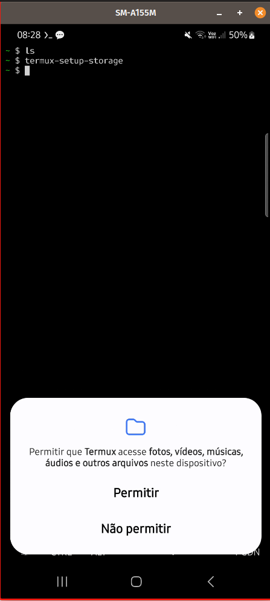
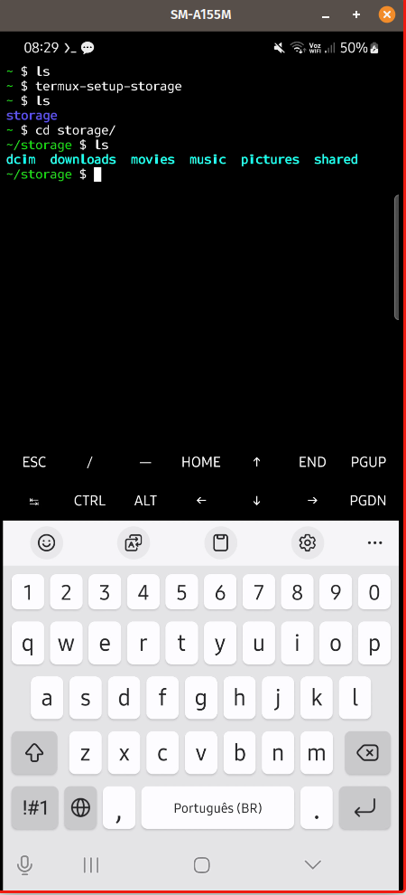

4. Agora vou atualizar os repositórios de aplicativos e atualizar os aplicativos atuais:

~~~bash
termux-setup-storage
~~~

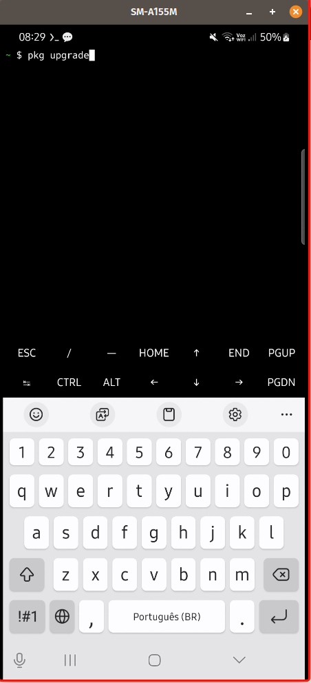

Aqui mostra o que será atualizado e o que sera instalado e pede se você deseja continuar (y-sim ou n-não), eu digitei y.

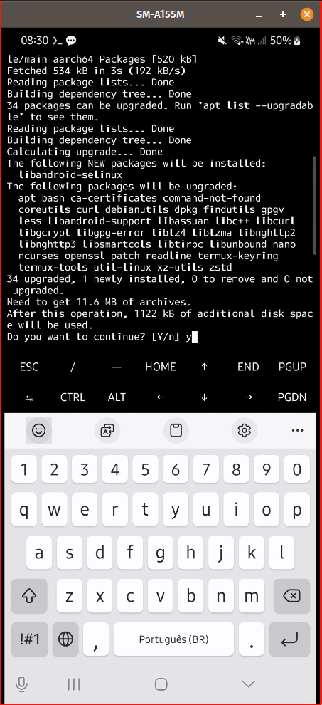

Durante o processo ele pode pedir o que fazer sobre as source-list (fica a seu critério), eu mantive o default.

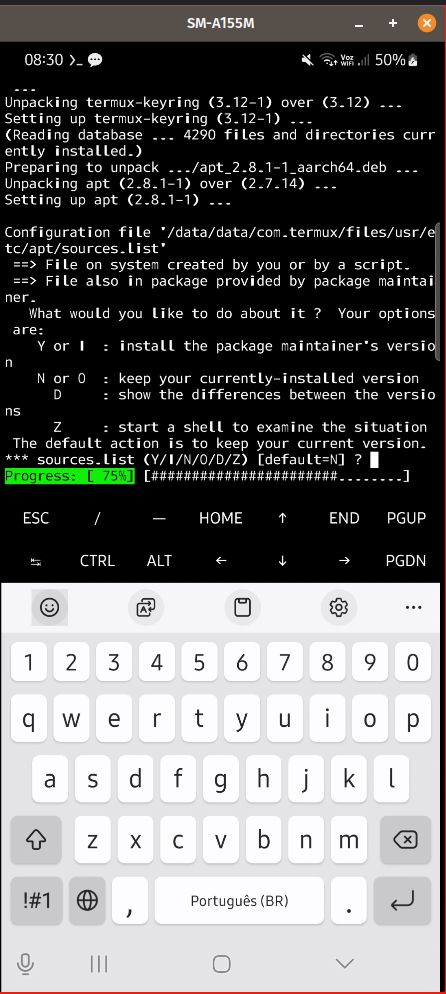

Lembrando que é possível instalar vários aplicativos para o terminal, utilizando o pkg, como, por exemplo, o Neofetch:

~~~bash
pkg install neofetch
~~~

Feito isto podemos seguir em frente e seguir o procedimento descrito em [2](https://gitlab.com/-/snippets/3682973).

5. Instalaremos o git, cmake e a linguagem go para poder instalar o Ollama em nosso dispositivo:

~~~bash
pkg install git cmake golang
~~~

Lembrando que é uma instalação grande (aqui foram 801 megas):

Após efetuar a instalação ele responde às versões instaladas dos aplicativos:

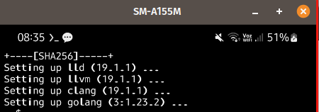

6. Agora podemos clonar o repositório e será criada a pasta Ollama:

~~~bash
git clone --depth 1 https://github.com/ollama/ollama.git
~~~

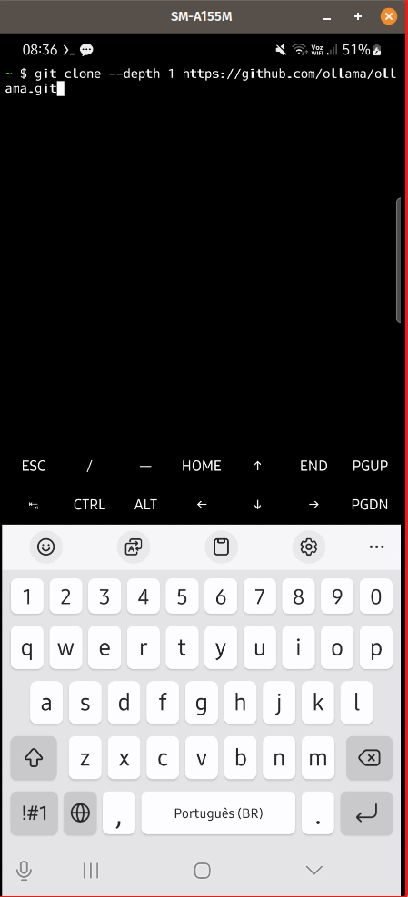

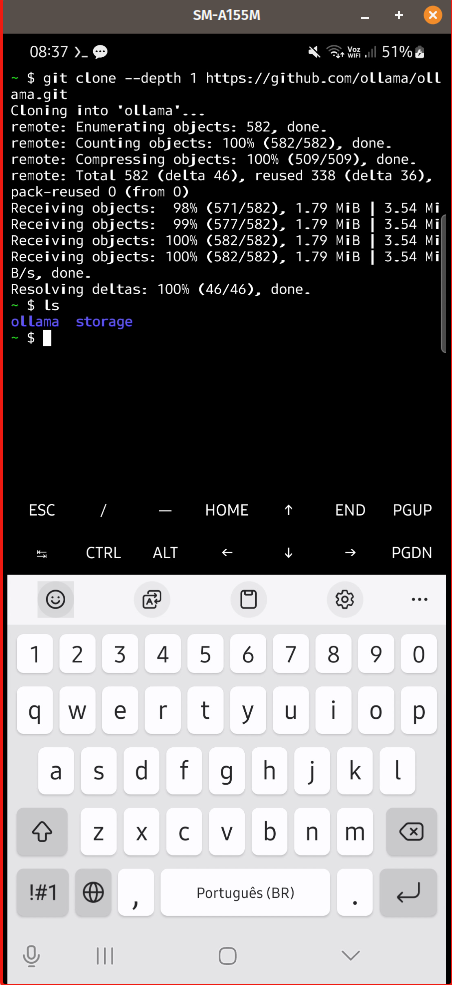

Devemos entrar nesta pasta para poder construir o Ollama:

~~~bash
cd ollama
~~~

7. Agora construiremos o Ollama da fonte, lembrando que este processo será demorado.

~~~bash
go generate ./...
~~~

~~~bash
go build .
~~~

Após a instalação do Ollama, agora podemos instanciar o seu servidor.

7. Instanciando o servidor do Ollama:

~~~bash
./ollama serve &
~~~

Observe que agora tem um novo aplicativo chamado Ollama na pasta ollama:

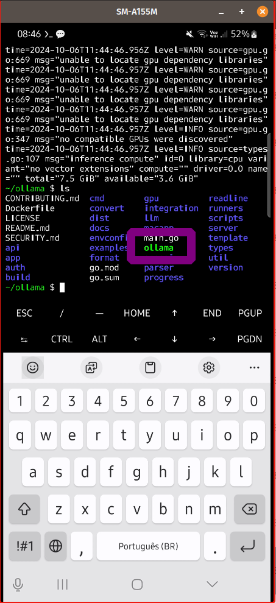

Agora você pode utilizar os comandos do Ollama para rodar e gerenciar seus modelos de LLMs locais, como, por exemplo, listar os modelos instalados como: 

~~~bash
./ollama ls
~~~

8. Agora instalemos o [llama3.2:1b](https://ollama.com/library/llama3.2) 

~~~bash
./ollama run llama3.2:1b
~~~

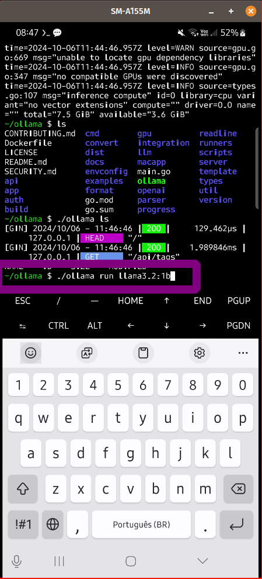

Após instalação (baixará localmente o modelo, neste caso foram mais de 1 GB), o prompt estará disponível:

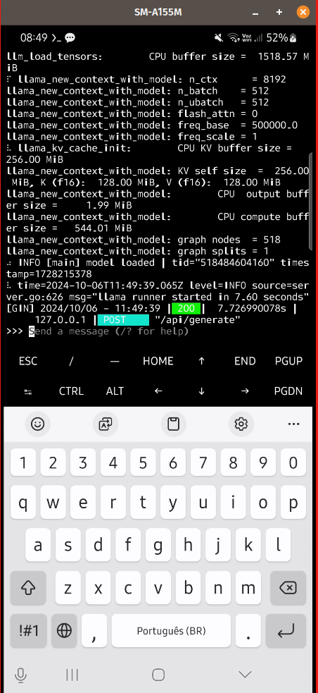

Você pode começar a fazer seus testes:

Caso você queira parar o prompt ou sair do mesmo, você pode utilizar o comando CTRL+d

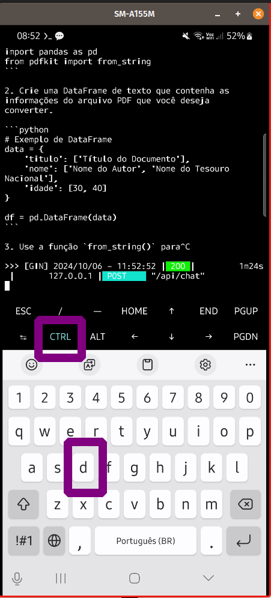

9. Fora do Ollama, agora testarei a instalação de outros modelos como o [qwen2.5:0.5b](https://ollama.com/library/qwen2.5:0.5b), mais leve que o anterior.

~~~bash
./ollama run qwen2.5:0.5b
~~~

Já instalado, é possível listar os 2 modelos LLMs baixados:

9. Agora vamos continuar o script, para remover a pasta de instalação do Go e ganhar espaço:

~~~bash
chmod -R 700 ~go
rm -r ~/go
~~~

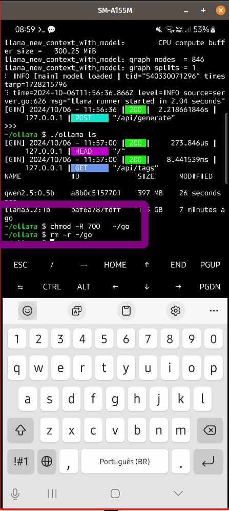

E como o Termux não possui o .local/bin em seu PATH (embora você possa adicioná-lo se preferir). Se você quiser mover o binário ollama para a pasta bin, você pode fazer o seguinte.

~~~bash
cp ollama/ollama /data/data/com.termux/files/usr/bin/
~~~

E agora posso rodar o Ollama em qualquer local do Termux:

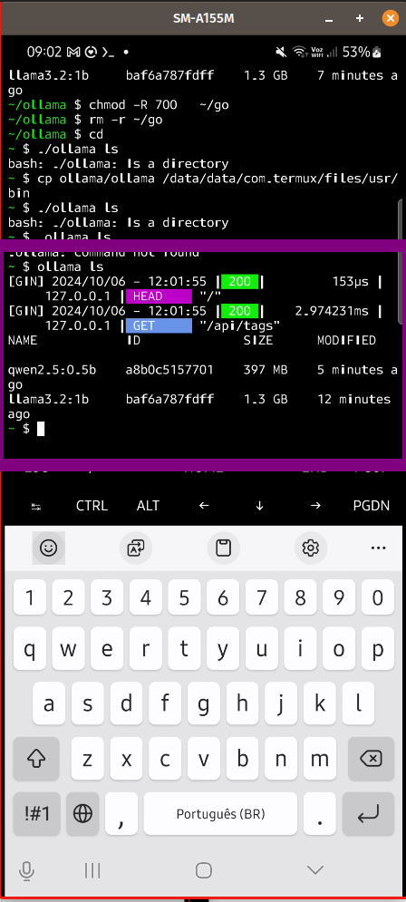

Para sair do Termux você pode digitar exit.

~~~bash
exit
~~~

Para executar novamente após sair, você pode entrar novamente no aplicativo no seu celular:

E digitar os comandos desejados:

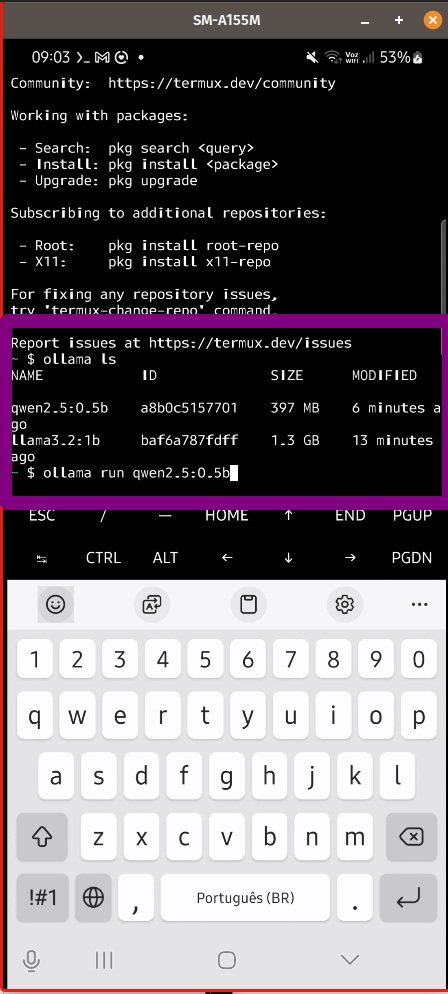

Pode acontecer que seja necessário reiniciar o servidor Ollama e ai, sim, poder aplicar os comandos para utilizar o LLM novamente (O vídeo acima mostrou este caso):

~~~bash
./ollama serve &
~~~

Caso você queira obter dados de desempenho das respostas do prompt, você pode incluir --verbose da chamada do run:

~~~bash
ollama run qwen2.5:0.5b --verbose
~~~

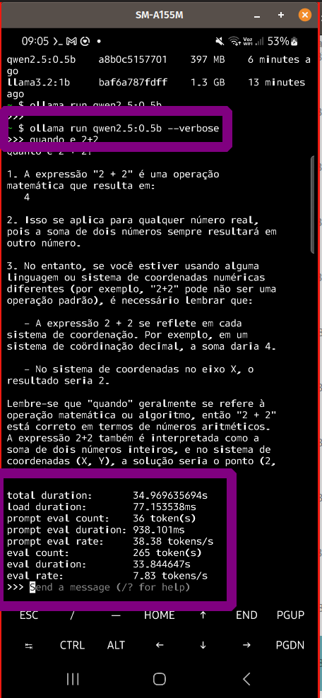

Desta forma você pode realizar seus testes com o Ollama no seu Android e instalar outros modelos LLMs que não estão disponíveis no LM Playground.

Referências:

[[1](https://gitlab.com/-/snippets/3682973)] “Ollama on Termux ($3682973) · Snippets · GitLab”. GitLab, 17 de junho de 2024, https://gitlab.com/-/snippets/3682973.

[[2](https://medium.com/@researchgraph/how-to-run-llama-3-2-on-android-phone-64be7783c89f)] Graph, Research. “How to Run Llama 3.2 on Android Phone”. Medium, 30 de setembro de 2024, https://medium.com/@researchgraph/how-to-run-llama-3-2-on-android-phone-64be7783c89f.

Sucesso a todos! 