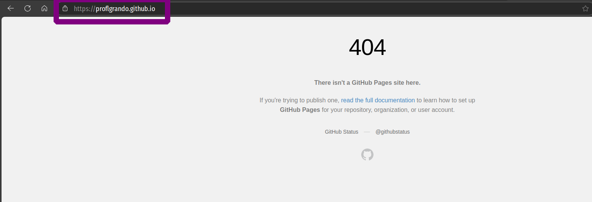
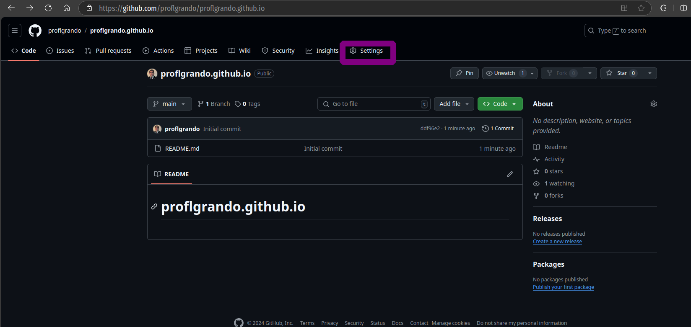
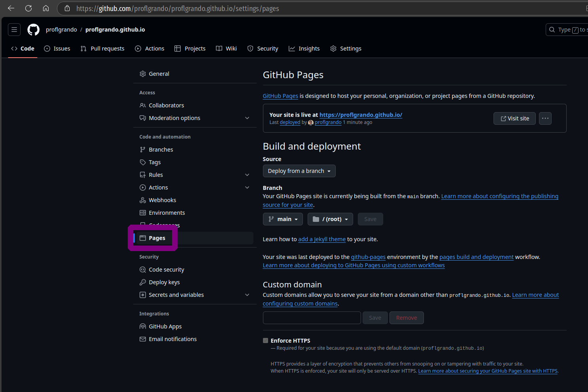
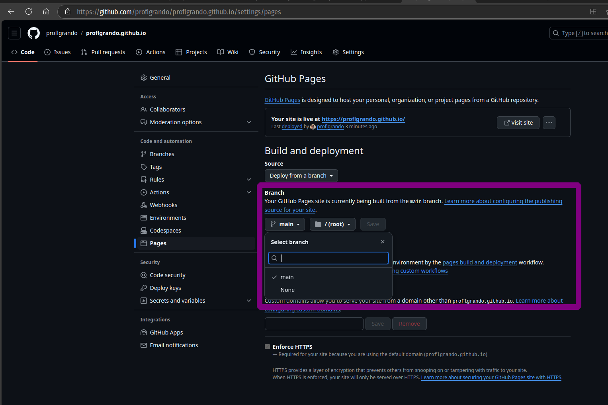
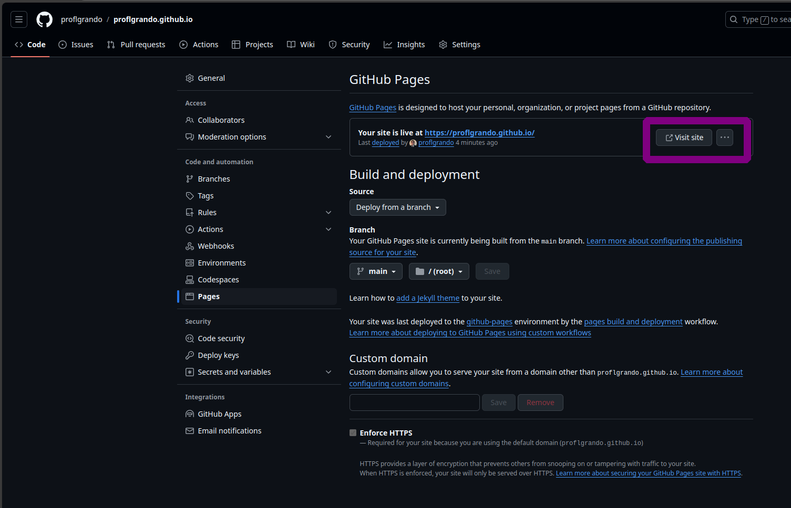
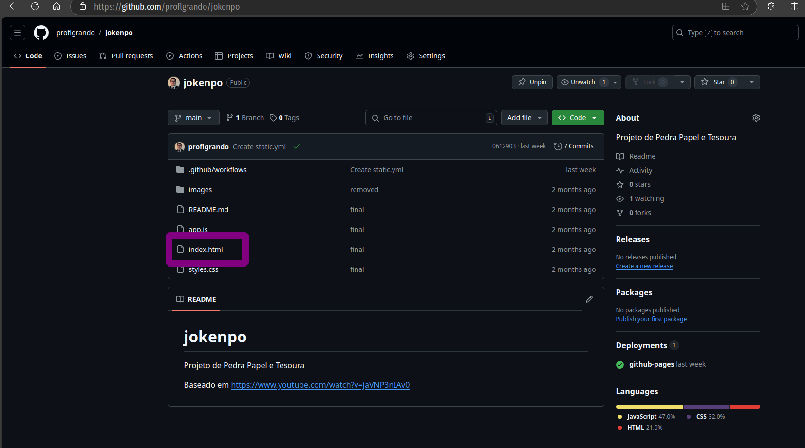
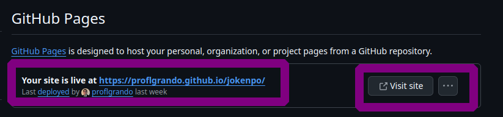
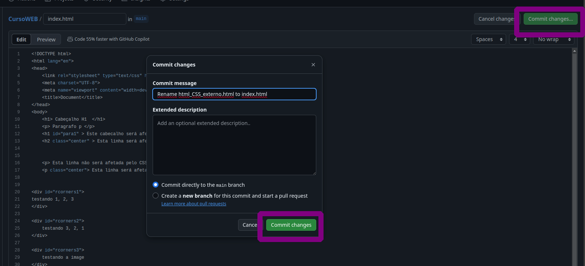
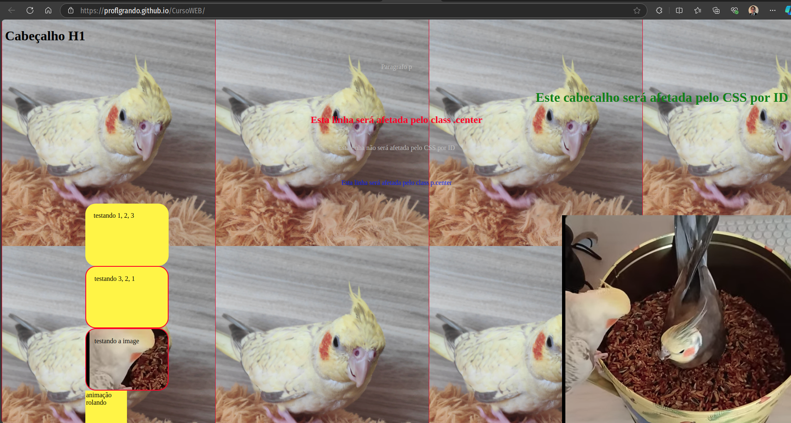

Existem várias formas de ter sua presença na internet, como o uso de redes sociais. No entanto, essas plataformas podem limitar o acesso do seu público, exigindo que se cadastrem e façam login. Mesmo quando permitem a leitura de conteúdo, geralmente é de forma restrita. Portanto, ter seu próprio link para que as pessoas acessem seu conteúdo de maneira facilitada é essencial.

As tecnologias de desenvolvimento web se dividem em sites estáticos e dinâmicos. Sites estáticos são fáceis de implementar, pois qualquer mudança ocorre diretamente no código-fonte. Contudo, eles são menos flexíveis para lidar com grandes volumes de dados, como um site de venda de carros usados. Em contraste, sites dinâmicos utilizam bancos de dados para fornecer informações em tempo real.

Neste guia, demonstrarei como criar seu próprio site utilizando o GitHub Pages, que pode ser uma ótima maneira de apresentar seus projetos ou servir como um currículo online. Lembre-se de que o modelo a seguir é simplista e serve apenas como exemplo. 

Antes de mais nada, leia a [Documentação do serviço](https://docs.github.com/pt/pages/getting-started-with-github-pages/about-github-pages) para saber se a sua ideia pode ser ou não implementada no GitHub Pages. Note que o GitHub Pages não suporta linguagens de servidor como PHP, Ruby ou Python.

## Criando sua página no GitHub Pages

1. Para começar, é necessário [criar uma conta no GitHub](https://docs.github.com/pt/get-started/start-your-journey/creating-an-account-on-github), caso ainda não possua uma. Após a criação, acesse a página inicial do seu perfil. No meu caso utilizo este [perfil](https://github.com/proflgrando) para poder compartilhar códigos com meus alunos.

2. Agora você deve criar um novo repositório:

E este repositório deve ser público e pode conter um arquivo README.md, mas deve ter o seguinte nome:

~~~bash
<seu_usuario_git>.github.io
~~~

No meu caso:

~~~bash
proflgrando.github.io
~~~

ou deste site:

~~~bash
lgrando1.github.io
~~~

Após criar o repositório, clicando no botão **Create repository**, você poderá acessá-lo:

3. Se você tentar acessar o site no seu navegador <seu_usuario_git>.github.io você ainda verá que ele está Offline: 

4. Então vamos realizar os ajustes finais, voltando na pagina do repositório do seu site, clique em **settings**:

5. Em código e automação em **Pages**:

E agora [fazer os ajustes](https://docs.github.com/pt/pages/getting-started-with-github-pages/configuring-a-publishing-source-for-your-github-pages-site#publishing-from-a-branch): 

**Fonte:** Deploy from a Branch (Fazer implantação de um branch)

**Compilação e implantação:** No menu suspenso de branch, selecione a fonte de publicação, no meu caso "main"

**Pasta:** você pode escolher uma pasta para a fonte de publicação, no meu caso "/(root)"

Clique em Save

[Lembrando que o GitHub Pages](https://docs.github.com/pt/pages/getting-started-with-github-pages/creating-a-github-pages-site#creating-your-site) ira procurar um arquivo *index.html*, *index.md* ou *README.md* como o arquivo de entrada do site

6. Agora você pode clicar em **Visit site** para ver o site disponível:

## 2. Criando seu portifólio:

Caso você tenha um projeto web que deseja apresentar ao público, é possível criar uma subpágina no seu site para demonstrar como ele será implementado. A URL do seu projeto terá o seguinte formato:

<seu_usuario_git>.github.io/<nome_do_repositório>

Aqui usarei como exemplo o Github Action como fonte de publicação, mas você pode aprender mais sobre outras fontes [aqui](https://docs.github.com/pt/pages/getting-started-with-github-pages/configuring-a-publishing-source-for-your-github-pages-site)

Um exemplo de repositório que ilustra esse conceito é o [repositório](https://github.com/proflgrando/jokenpo): 

Observe no arquivo *index.html* o conteúdo que está nele estará no [link](https://proflgrando.github.io/jokenpo).

Para isto, na página do repositório, clique em **settings** e depois em **Pages**: 

E em *Build and Deploymnent* escolha na fonte de da fonte **GitHub Actions**:

Agora você poderá acessar o site:

Se você tiver um repositório com vários arquivos HTML, você pode mudar o arquivo que deseja apresentar no site, alterando o nome do mesmo, como os [presentes neste repositório](https://github.com/proflgrando/CursoWEB):

Realizando o mesmo procedimento:

Pronto, o [site](https://proflgrando.github.io/CursoWEB) está acessível: 

### Referências:

**Sobre o GitHub Pages.** GitHub Docs. Disponível em: <https://docs.github.com/pt/pages/getting-started-with-github-pages/about-github-pages>. Acesso em: 7 out. 2024.

**Criar um site do GitHub Pages.** GitHub Docs. Disponível em: <https://docs.github.com/pt/pages/getting-started-with-github-pages/creating-a-github-pages-site>. Acesso em: 7 out. 2024.

**Configurar uma fonte de publicação para o site do GitHub Pages.** GitHub Docs. Disponível em: <https://docs.github.com/pt/pages/getting-started-with-github-pages/configuring-a-publishing-source-for-your-github-pages-site>. Acesso em: 7 out. 2024.

Sucesso a todos! 

