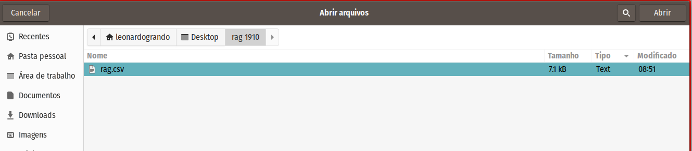
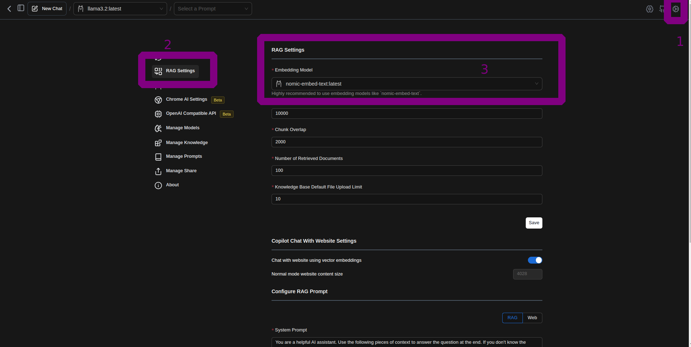
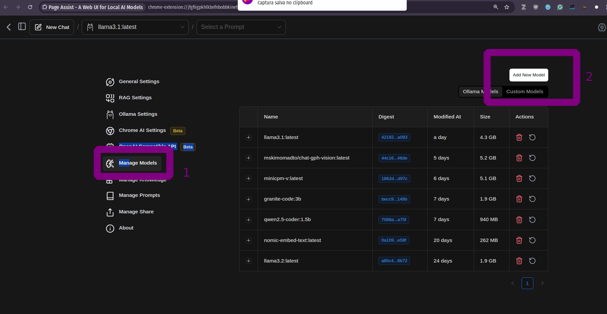
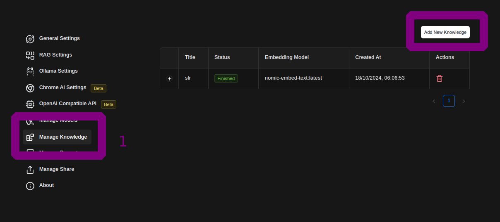
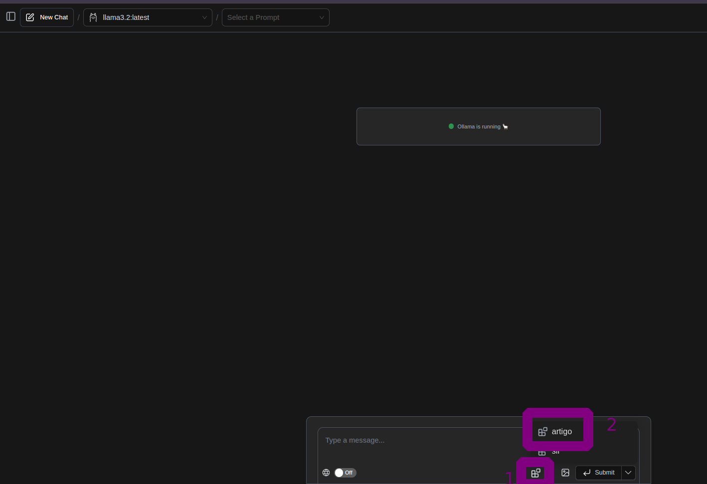
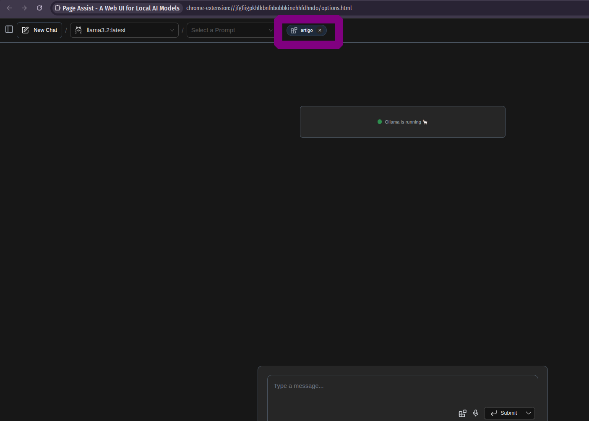
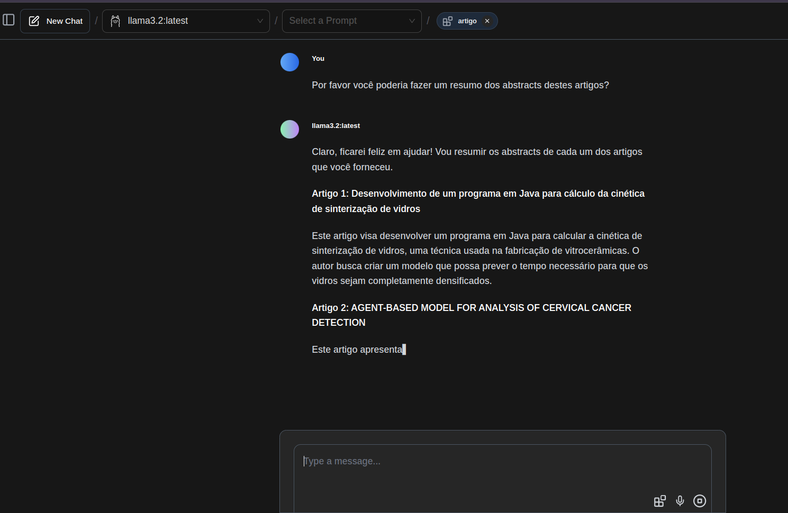
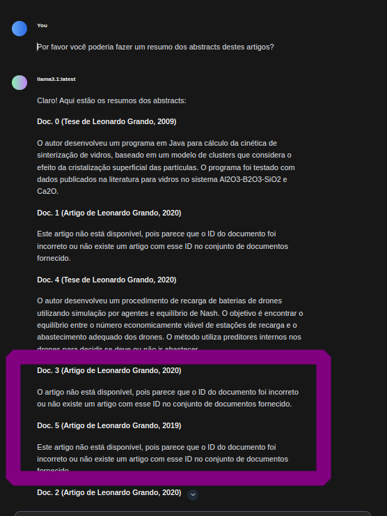

Outros posts sobre o tema:

- [Como Criar um Pipeline em Python para Testar Modelos no Hugging Face](https://lgrando1.github.io/post/hface/)
- [Dicas de Engenharia de Prompt](https://lgrando1.github.io/post/prompt1/)
- [Parte 1 - Instalando o Ollama no Linux](https://lgrando1.github.io/post/ollama/)
- [Parte 2 - Instalando o Ollama no Windows](https://lgrando1.github.io/post/ollamawin/)
- [Parte 3 - Instalando o Ollama no Android pt.1](https://lgrando1.github.io/post/llmandroid/)
- [Parte 4 - Instalando o Ollama no Android pt.2](https://lgrando1.github.io/post/llmtermux/)
- [Parte 5 - 4 Formas de se Utilizar LLMs Offlines em seu Computador](https://lgrando1.github.io/post/waysllms/)

---

Nesta postagem, apresento duas formas de realizar RAG em documentos de forma offline, utilizando o [LM Studio](https://lmstudio.ai/) e o [Ollama](https://ollama.com/).

[Geração Aumentada de Recuperação (RAG)](https://cloud.google.com/use-cases/retrieval-augmented-generation?hl=pt-BR) é uma técnica que combina modelos de linguagem com sistemas de busca, recuperando informações relevantes de documentos para melhorar respostas em tarefas de geração de texto.


Neste vídeo, demonstro como executar o RAG no LM Studio:

 


Quando gravei o vídeo acima, eu ainda não sabia como realizar o processo de RAG com o Ollama. Graças à excelente extensão [Page Assist](https://chromewebstore.google.com/detail/page-assist-a-web-ui-for/jfgfiigpkhlkbnfnbobbkinehhfdhndo), descobri que é possível fazê-lo também no Ollama, como apresentado aqui:

 

Para este vídeo, utilizei um notebook Acer Nitro com CPU Core i5 9300H, 16 GB de RAM e GPU Nvidia GeForce GTX 1650.

### Antes de mais nada, alguns lembretes:

1. Lembre-se de que, por rodarem offline, essas aplicações dependem do poder computacional do seu computador, da quantidade de memória RAM e da capacidade de processamento da sua GPU. 

2. **Importante:** Nunca use LLMs como oráculos ou fontes de informação definitiva; já encontrei vários erros em modelos, tanto online quanto offline. Utilize-os apenas como suporte para suas atividades.

Para este post, utilizei um arquivo no formato CSV, importado do Zotero, que contém as publicações acadêmicas das quais sou autor ou coautor. O arquivo pode ser [encontrado aqui](https://lgrando1.github.io/uploads/rag.csv).


Lembrando que, em ambos os casos, você vai precisar de um [modelo de embedding](https://ollama.com/library?q=embe), 
Embedding é uma técnica usada em aprendizado de máquina para converter palavras ou frases em vetores numéricos, permitindo que modelos de linguagem compreendam e processem o significado semântico das palavras em um espaço matemático. 
Para saber mais, clique [aqui](https://www.elastic.co/pt/what-is/word-embedding).

## 1. LM Studio

Ainda não havia testado esta ferramenta, mas achei o [LM Studio](https://lmstudio.ai/) muito prático. A grande vantagem é que não precisa de instalação no Linux (não testei em outros sistemas operacionais). Você pode conhecer os modelos disponíveis neste [link](https://lmstudio.ai/models). 

Porém, seu uso se mostrou mais complicado do que o Ollama, e não tive sucesso em rodar modelos com mais de 3 bilhões de parâmetros na minha máquina.

O mais interessante é que ele tem uma interface bem intuitiva:


Ele facilita o processo de controle dos modelos LLMs baixados:


### 1.1 - Adicionando um arquivo para RAG

Para incluir um arquivo e realizar o processo de RAG, basta ir à página principal do LM Studio, clicar no ícone de anexo (1) e selecionar o arquivo:




### 1.2 - Começando a "conversar" sobre o arquivo

Depois, é só começar a interagir com o arquivo:


No LM Studio, estou utilizando o modelo Llama3.2:3B (não consegui rodar modelos maiores). Note que ele pode se perder ou gerar respostas alucinadas.


## 2. Ollama

Para realizar RAG no Ollama, é possível utilizar a extensão Page Assist e, após alguns ajustes, começar a realizar inferências.

### 2.1 - Configurando a extensão Page Assist

Com o servidor do Ollama rodando, basta abrir a extensão em seu navegador:


Clique no ícone de ajustes (1), vá até o campo "RAG Settings" (2) e escolha o modelo de embedding (3). Lembre-se de que você já deve ter baixado esse modelo; caso contrário, ele não aparecerá.



Caso você ainda não tenha um modelo de embedding, é possível baixar, por exemplo, o modelo [Nomic-Embed-text](https://ollama.com/library/nomic-embed-text) com o comando no terminal:

```bash
ollama pull nomic-embed-text
```
Ou diretamente pela extensão:




### 2.2 - Adicionando um arquivo para RAG

Agora, podemos incluir o arquivo que desejamos analisar, clicando (1) em "Manage Knowledge" e adicionando um novo conhecimento no botão "Add New Knowledge".



A extensão suporta alguns tipos de arquivos, e você deve nomear esta base de conhecimento:


Aguarde enquanto ele processa o documento (embedding):


Agora, a base de conhecimento está disponível:


### 2.3 - Selecionando a base de conhecimento

Voltando à tela inicial da extensão, você verá um novo ícone onde digita as mensagens (1). Clicando nele, abrirá as bases de conhecimento (2), e assim você poderá selecionar aquela que deseja utilizar para o RAG.


Após escolher, a base de conhecimento selecionada aparecerá na parte superior da interface:



### 2.4 - Interagindo com o modelo sobre o documento

Agora, é só começar a "conversar" com o modelo sobre o documento:





### Observações

Devido à limitação do modelo e do hardware, podem ocorrer alucinações e incorreções:

- Aqui, ele mostrou 4 artigos em vez de 5:


- E aqui, ao utilizar um modelo maior (Llama3.1:8B), ele se perdeu:



## Conclusão

As ferramentas e os modelos utilizados ainda são experimentais e devem ser validados antes de qualquer uso em produção. Para analisar arquivos maiores, são necessários mais recursos computacionais, mas isso não diminui o valor do experimento, que pode ser útil em casos específicos, como a análise de currículos, documentos pequenos ou anotações.

Sucesso a todos!

<meta name="fediverse:creator" content="@lgrando@cwb.social">

