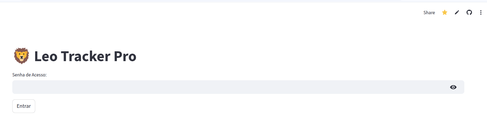
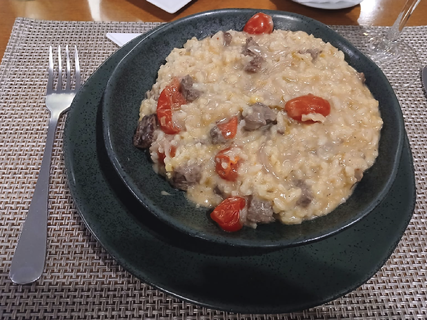
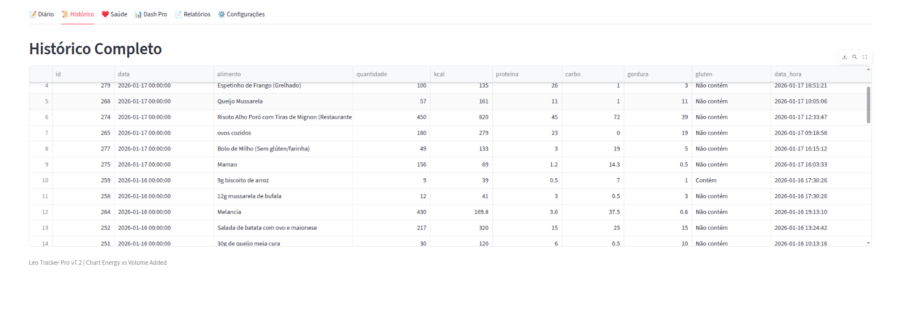
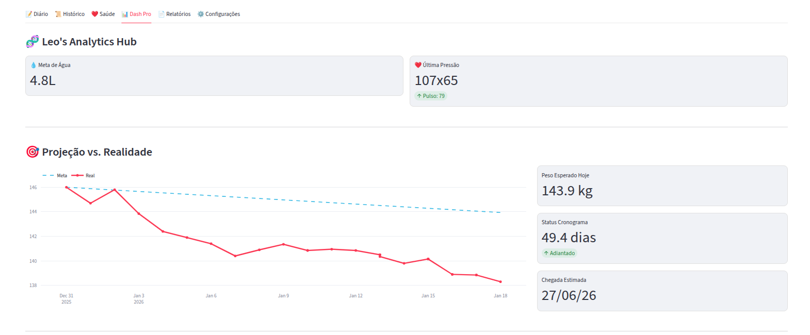
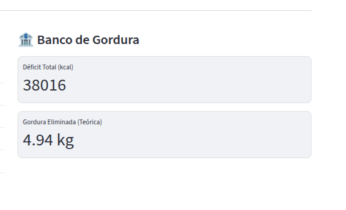
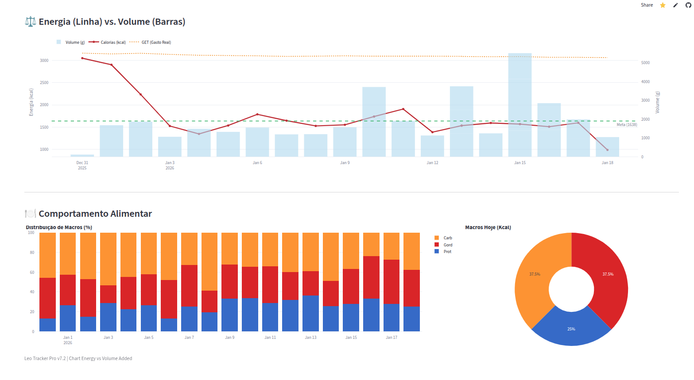
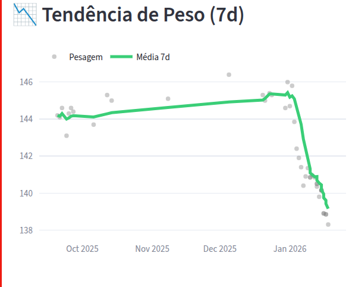
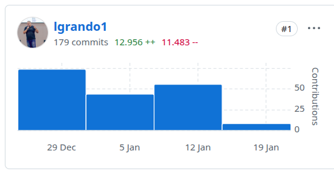

Como professor e engenheiro, tenho uma premissa básica: **dados vencem a ansiedade**. Quando iniciei meu processo de emagrecimento no final de 2025 (saindo dos 146kg), eu não queria apenas "pesar menos". Eu queria entender a **física** do meu corpo.

Os apps tradicionais falhavam em me dar essa visão analítica. Ou eram caixas pretas, ou queriam vender planos premium cheios de anúncios. Então, decidi construir o **Leo Tracker Pro**: uma aplicação *full-stack* que une termodinâmica, equações antropométricas e Inteligência Artificial para monitorar minha evolução.

Este projeto foi também um experimento de **Vibe Coding**. Utilizei IAs (Gemini e Groq) como "parceiros de paridade", focando na lógica de negócio e na fisiologia enquanto a IA acelerava a escrita do código. O resultado? Uma aplicação madura construída nas horas vagas.

## A Stack: Simples, Rápida e Serverless (Custo Zero)

Para tirar a ideia do papel rápido, usei uma stack moderna e que, incrivelmente, roda com custo zero nos tiers gratuitos:

* **Frontend/Backend:** [Streamlit](https://streamlit.io/) (Python puro, sem HTML/CSS complexo).
* **Database:** PostgreSQL via [Neon.tech](https://neon.tech/) (*Serverless* é vida!).
* **ORM:** SQLAlchemy (Com `pool_pre_ping=True` para blindar conexões instáveis).
* **IA:** Groq API (Llama 3) para processamento de linguagem natural.

## 1. Segurança e Privacidade
Apesar de ser um projeto pessoal, a segurança é inegociável. Implementei autenticação para proteger meus dados de saúde e evitar que crawlers de LLMs usem meus dados pessoais para treinamento.



## 2. A "Mágica" do Input (IA na Prática)
O maior gargalo de qualquer dieta é registrar a comida. Ninguém quer procurar "arroz" em uma lista de 500 itens.

A tela inicial do **Leo Tracker** resolve isso. Ela me dá um panorama imediato dos macros do dia e permite entrada de dados fluida.


### Do Mundo Real para o Banco de Dados

O maior gargalo de uma dieta é o "mundo real". Quando estou em um restaurante e recebo um prato como este risoto de filé com tomates confit:



Eu não tenho como pesar os ingredientes separadamente. É aqui que entra o **Vibe Coding** para reduzir a fricção. Eu utilizo uma abordagem híbrida:

1.  **Visão Computacional (Multimodal):** Posso enviar esta foto para uma IA (como o Gemini ou GPT-4o) e solicitar: *"Gere um JSON nutricional deste prato"*.
2.  **Processamento de Texto (Groq/Llama 3):** Ou, simplesmente digito no meu app: *"Risoto de queijo com iscas de mignon e tomate cereja, prato generoso de restaurante"*.

Em ambos os casos, o sistema recebe os dados e aplica uma camada de **regras de negócio** via código.

#### A "Mágica" do Groq (Engenharia de Prompt)

Para garantir que a estimativa não seja ingênua, configurei o *System Prompt* da API do Groq para atuar como um "Nutricionista Matemático". Ele é instruído explicitamente a considerar a **gordura oculta** — o grande vilão de quem come fora.

Veja o trecho do código que garante a precisão:

```python
prompt_system = """
Aja como Nutricionista Matemático.
Regras de Cálculo:
1. Vegetais: ~0.3 kcal/g | Arroz/Massas: ~1.3 kcal/g | Carnes: ~1.5 kcal/g
2. GORDURA OCULTA: Se o contexto for 'restaurante', ADICIONE +10g de gordura (manteiga/óleo).
Retorne APENAS JSON.
"""

```

Assim, quando digito "Risoto", a IA não calcula apenas o arroz e a carne; ela contabiliza a manteiga da finalização e o azeite do refogado. O resultado é um registro salvo no banco de dados com precisão muito superior à minha intuição.


## 3. Auditoria e Histórico
IAs podem alucinar. Por isso, a aba **Histórico** funciona como minha auditoria. Posso ver exatamente o que foi registrado. O cálculo calórico é derivado matematicamente dos macronutrientes, garantindo consistência física.



## 4. O Painel do Engenheiro (Dash Pro)
Aqui é onde a mágica acontece. A aba **Dash Pro** não mostra apenas o peso, mas cruza dados para gerar *insights*.



### Projeção vs. Realidade
O gráfico acima mostra a linha tracejada (minha meta de 0.8kg/sem) contra a linha vermelha (meu peso real). O sistema calcula:
* **Status:** Estou "Adiantado" ou "Atrasado"?
* **Previsão:** Se continuar assim, em que dia exato chego aos 120kg?

### O "Banco de Gordura": Termodinâmica Aplicada
Um dos maiores desafios é a flutuação hídrica. Um dia você come sal a mais e a balança sobe. Isso desmotiva.

Para combater isso, criei o **"Banco de Gordura"**. A lógica é baseada na 1ª Lei da Termodinâmica:
```python
# Lógica simplificada
deficit_acumulado += (gasto_energetico_dia_real - calorias_consumidas)
gordura_eliminada_teorica = deficit_acumulado / 7700

```



Isso me permite ver que, mesmo que a balança suba hoje, meu "Banco" mostra que eliminei quase 5kg de gordura pura. É matemática contra a frustração.

### Engenharia de Alimentos: Energia vs. Volume

Este é meu gráfico favorito. Ele cruza **Calorias (Linha Vermelha)** com **Volume de Comida (Barras Azuis)**.

Meu objetivo é manter as barras azuis altas (estômago cheio/saciedade) e a linha vermelha baixa. Isso me força a escolher alimentos de baixa densidade calórica. É visual e intuitivo.



### Tendência (Sinal vs. Ruído)

Utilizo uma média móvel de 7 dias (Linha Verde) para ignorar os ruídos diários da balança.



## 5. Saúde e Metas

Monitoro também pressão arterial e medidas corporais. Para o cálculo de gordura, abandonei o IMC e Adipômetros (imprecisos para obesos) e implementei a **Equação de Weltman** via código, que usa a circunferência abdominal.

O sistema é flexível. A aba **Configurações** permite ajustar minhas metas metabólicas conforme meu corpo muda.

E, claro, gera relatórios em Excel prontos para enviar à nutricionista.

## Conclusão: O Poder do Vibe Coding

Eu poderia ter criado esta aplicação sem o uso de IA, mas o tempo seria exponencialmente maior.

O gráfico de commits mostra a intensidade do desenvolvimento. Em 15 dias, saí do zero para uma aplicação complexa, segura e hospedada na nuvem. O **Leo Tracker Pro** me permitiu focar na solução do problema (minha saúde), transformando dados em motivação.




🔗 **Conheça o projeto:** [github.com/lgrando1/leo-tracker](https://github.com/lgrando1/leo-tracker)

---

*Nota de transparência: Este post foi escrito com auxílio da IA que construiu o próprio sistema.*

```

```